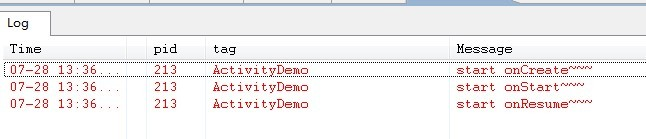

本篇文章为转载，原文：[两分钟彻底让你明白Android Activity生命周期（图文）！](http://blog.csdn.net/android_tutor/article/details/5772285)

# 两分钟彻底让你明白Android Activity生命周期（图文）！

大家好，今天给大家详解一下Android中Activity的生命周期，我在前面也曾经讲过这方面的内容，但是像网上大多数文章一样，基本都是翻译Android API，过于笼统，相信大家看了，会有一点点的帮组，但是还不能完全吃透，所以我今天特意在重新总结一下。

首先看一下Android api中所提供的Activity生命周期图（不明白的，可以看完整篇文章，在回头看一下这个图，你会明白的）：

Activity其实是继承了ApplicationContext这个类，我们可以重写以下方法，如下代码：
	
	public class Activity extends ApplicationContext {
		protected void onCreate(Bundle savedInstanceState);
		protected void onStart();
		protected void onRestart();
		protected void onResume();
		protected void onPause();
		protected void onStop();
		protected void onDestory();
	}

为了便于大家更好的理解，我简单的写了一个demo，不明白Activity生命周期的朋友，可以亲手实践一下，大家按照我的步骤来。

第一步：新建一个Android工程，我这里命名为ActivityDemo.

第二布：修改ActivityDemo.java(我这里重写了以上的七种方法，主要用Log打印)，代码如下：

	package com.tutor.activitydemo;
	import android.app.Activity;
	import android.os.Bundle;
	import android.util.Log;
	
	public class ActivityDemo extends Activity {
		
		private static final String TAG = "ActivityDemo";
		
		protected void onCreate(Bundle savedInstanceState){
			super.onCreate(savedInstanceState);
			setContentView(R.layout.main);
			
			Log.e(TAG, "start onCreate~~~");
		}
		
		protected void onStart(){
			super.onStart();
			
			Log.e(TAG, "start onStart~~~");
		}
		
		protected void onRestart(){
			super.onRestart();
			
			Log.e(TAG, "start onRestart~~~");
		}
		
		protected void onResume(){
			super.onResume();
			
			Log.e(TAG, "start onResume~~~");
		}
		
		protected void onPause(){
			super.onPause();
			
			Log.e(TAG, "start onPause~~~");
		}
		
		protected void onStop(){
			super.onStop();
		
			Log.e(TAG, "start onStop~~~");
		}
		
		protected void onDestory(){
			super.onDestory();
			
			Log.e(TAG, "start onDestory~~~");
		}
	}
	
第三步：运行上述工程，效果图如下（没什么特别的）:

核心在Logcat视窗里，如果你还不会用Logcat，可以看一下我的这篇文章[Log图文详解(Log.v,Log.d,Log.i,Log.w,Log.e)](http://blog.csdn.net/Android_Tutor/article/details/5081713)，我们打开应用时先后执行了onCreate()->onStart()->onResume()三个方法，看一下Logcat视窗如下：

BACK键：

当我们按下BACK键时，我们的这个应用程序将结束，这时我们将先后调用了onPause()->onStop()->onDestory()三个方法，如下图所示：

HOME键：

当我们打开应用程序时，比如浏览器，我正在浏览NBA新闻，看到一半时，我突然想听歌，这时候我们会选择按HOME键，然后去打开音乐应用程序，而我们按下HOME键的时候，Activity先后执行了onPause()->onStop()这两个方法，这时候应用程序并没有销毁。如下图所示：

而当我们再次启动ActivityDemo应用程序时，则先后分别执行了onRestart()->onStart()->onResume()三个方法，如下图所示：

这时候我们会引出一个问题，当我们按下HOME键，然后再进入ActivityDemo应用时，我们应用的状态应该和按下HOME键之前的状态是一样的，同样为了方便理解，在这里我将ActivityDemo的代码做一些修改，就是增加一个EditText.

第四步：修改main.xml布局文件（增加一个EditText），代码如下：

	<?xml version="1.0" encoding="utf-8"?>
	<LinearLayout xmlns:android="http://schemas.android.com/apk/res/android"
		android:layout_width="fill_parent"
		android:layout_height="fill_parent"
		android:orientation="vertical">
		
		<TextView
			android:width="fill_parent"
			android:height="wrap_content"
			android:text="@string/hello"/>
			
		<EditText
			android:id="@+id/editText"
			android:width="fill_parent"
			android:height="wrap_content"/>
	</LinearLayout>
第五步：然后其他不变，运行ActivityDemo程序，在EditText中输入如“Frankie”字符串（如下图）：

这时候大家可以按下Home键，然后再次启动ActivityDemo程序，这时候EditText里并没有我们输入的“Frankie”字样，如下图：

这显然不是一个合格的应用程序，所以需要我们在Activity几个方法里面实现，如下第六步所示：

第六步：修改ActivityDemo.java 代码如下：

	package com.tutor.activitydemo;
	import android.app.Activity;
	import android.os.Bundle;
	import android.util.Log;
	import android.widget.EditText;
	
	public class ActivityDemo extends Activity {
		
		private static final String TAG = "ActivityDemo";
		
		private EditText mEditText;
		
		// 定义mString 用于存取EditText输入的值
		private String mString;
		
		protected void onCreate(Bundle savedInstanceState){
			super.onCreate(savedInstanceState);
			setContentView(R.layout.main);
			
			mEditText = (EditText) findViewById(R.id.editText);
			
			Log.e(TAG, "start onCreate~~~");
		}
		
		protected void onStart(){
			super.onStart();
			
			Log.e(TAG, "start onStart~~~");
		}
		
		// 当按下HOME键，再次启动应用时，恢复之前存的值
		protected void onRestart(){
			super.onRestart();
			
			mEditText.setText(mString);
			
			Log.e(TAG, "start onRestart~~~");
		}
		
		protected void onResume(){
			super.onResume();
			
			Log.e(TAG, "start onResume~~~");
		}
		
		// 当按下HOME键时，在onPause()方法里，保存EditText输入的值
		protected void onPause(){
			super.onPause();
			
			mString = mEditText.getText().toString();
			
			Log.e(TAG, "start onPause~~~");
		}
		
		protected void onStop(){
			super.onStop();
		
			Log.e(TAG, "start onStop~~~");
		}
		
		protected void onDestory(){
			super.onDestory();
			
			Log.e(TAG, "start onDestory~~~");
		}
	}
第七步：重新运行ActivityDemo程序，重复第五步操作，当我们按下HOME键，再次启动应用时，EditText里有之前输入的值。