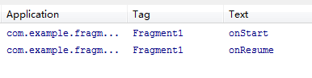

本篇文章为转载，原文地址：[http://blog.csdn.net/guolin_blog/article/details/8881711](http://blog.csdn.net/guolin_blog/article/details/8881711)

# Android Fragment完全解析，关于碎片你所需知道的一切

我们都知道，Android上的界面展示都是通过Activity实现的，Activity实在是太常用了，我相信大家都已经非常熟悉了，这里就不再赘述。

但是Activity也有它的局限性，同样的界面在手机上显示可能很好看，在平板上就未必了，因为平板的屏幕非常大，手机的界面放在平板上可能会有过分被拉长、控件间距过大等情况。这个时候更好的体验效果是在Activity中嵌入"小Activity"，然后每个"小Activity"又可以拥有自己的布局。因此，我们今天的主角Fragment登场了。

## Fragment初探

为了让界面可以在平板上更好地展示，Android在3.0版本引入了Fragment(碎片)功能，它非常类似于Activity，可以像Activity一样包含布局。Fragment通常是嵌套在Activity中使用的，现在想象这种场景：有两个Fragment，Fragment 1包含了一个ListView，每行显示一本书的标题。Fragment 2包含了TextView和ImageView，来显示书的详细内容和图片。

如果现在程序运行竖屏模式的平板或手机上，Fragment 1可能嵌入在一个Activity中，而Fragment 2可能嵌入在另一个Activity中，如下图所示：   

而如果现在程序运行在横屏模式的平板上，两个Fragment就可以嵌入在同一个Activity中了，如下图所示：   

由此可以看出，使用Fragment可以让我们更加充分地利用平板的屏幕空间，下面我们一起来探究下如何使用Fragment。

首先需要注意，Fragment是在3.0版本引入的，如果你使用的是3.0之前的系统，需要先导入android-support-v4的jar包才能使用Fragment功能。

新建一个项目叫做Fragments，然后在layout文件夹下新建一个名为fragment1.xml的布局文件：

	<LinearLayout xmlns:android="http://schemas.android.com/apk/res/android"
	    android:layout_width="match_parent"
	    android:layout_height="match_parent"
	    android:background="#00ff00" >
	
	    <TextView
	        android:layout_width="wrap_content"
	        android:layout_height="wrap_content"
	        android:text="This is fragment 1"
	        android:textColor="#000000"
	        android:textSize="25sp" />
	
	</LinearLayout>
	
可以看到，这个布局文件非常简单，只有一个LinearLayout，里面加入了一个TextView。我们如法炮制再新建一个fragment2.xml ：

	<LinearLayout xmlns:android="http://schemas.android.com/apk/res/android"
	    android:layout_width="match_parent"
	    android:layout_height="match_parent"
	    android:background="#ffff00" >
	
	    <TextView
	        android:layout_width="wrap_content"
	        android:layout_height="wrap_content"
	        android:text="This is fragment 2"
	        android:textColor="#000000"
	        android:textSize="25sp" />
	
	</LinearLayout>
	
然后新建一个类Fragment1，这个类是继承自Fragment的：

	public class Fragment1 extends Fragment {
	
		@Override
		public View onCreateView(LayoutInflater inflater, ViewGroup container, Bundle savedInstanceState) {
			return inflater.inflate(R.layout.fragment1, container, false);
		}
	}
	
我们可以看到，这个类也非常简单，主要就是加载了我们刚刚写好的fragment1.xml布局文件并返回。同样的方法，我们再写好Fragment2 ：

	public class Fragment2 extends Fragment {
	
		@Override
		public View onCreateView(LayoutInflater inflater, ViewGroup container, Bundle savedInstanceState) {
			return inflater.inflate(R.layout.fragment2, container, false);
		}
	
	}
	
然后打开或新建activity_main.xml作为主Activity的布局文件，在里面加入两个Fragment的引用，使用android:name前缀来引用具体的Fragment：

	<LinearLayout xmlns:android="http://schemas.android.com/apk/res/android"
	    android:layout_width="match_parent"
	    android:layout_height="match_parent"
	    android:baselineAligned="false" >
	
	    <fragment
	        android:id="@+id/fragment1"
	        android:name="com.example.fragmentdemo.Fragment1"
	        android:layout_width="0dip"
	        android:layout_height="match_parent"
	        android:layout_weight="1" />
	
	    <fragment
	        android:id="@+id/fragment2"
	        android:name="com.example.fragmentdemo.Fragment2"
	        android:layout_width="0dip"
	        android:layout_height="match_parent"
	        android:layout_weight="1" />
	
	</LinearLayout>

最后打开或新建MainActivity作为程序的主Activity，里面的代码非常简单，都是自动生成的：

	public class MainActivity extends Activity {
	
		@Override
		protected void onCreate(Bundle savedInstanceState) {
			super.onCreate(savedInstanceState);
			setContentView(R.layout.activity_main);
		}
	
	}
	
现在我们来运行一次程序，就会看到，一个Activity很融洽地包含了两个Fragment，这两个Fragment平分了整个屏幕，效果图如下：		

## 动态添加Fragment

你已经学会了如何在XML中使用Fragment，但是这仅仅是Fragment最简单的功能而已。Fragment真正的强大之处在于可以动态地添加到Activity当中，因此这也是你必须要掌握的东西。当你学会了在程序运行时向Activity添加Fragment，程序的界面就可以定制的更加多样化。下面我们立刻来看看，如何动态添加Fragment。

还是在上一节代码的基础上修改，打开activity_main.xml，将其中对Fragment的引用都删除，只保留最外层的LinearLayout，并给它添加一个id，因为我们要动态添加Fragment，不用在XML里添加了，删除后代码如下：

	<LinearLayout xmlns:android="http://schemas.android.com/apk/res/android"
	    android:id="@+id/main_layout"
	    android:layout_width="match_parent"
	    android:layout_height="match_parent"
	    android:baselineAligned="false" >
	
	</LinearLayout>
	
然后打开MainActivity，修改其中的代码如下所示：

	public class MainActivity extends Activity {
		
		@Override
		protected void onCreate(Bundle savedInstanceState) {
			super.onCreate(savedInstanceState);
			setContentView(R.layout.activity_main);
		
			Display display = getWindowManager().getDefaultDisplay();
			
			if(display.getWidth() > display.getHeight()) {
				Fragment1 fragment1 = new Fragment1();
				getFragmentManager().beginTransaction().replace(R.id.main_layout, fragment1).commit();
			} else {
				Fragment2 fragment2 = new Fragment2();
				getFragmentManager().beginTransaction().replace(R.id.main_layout, fragment2).commit();
			}
		}
	}
	
首先，我们要获取屏幕的宽度和高度，然后进行判断，如果屏幕宽度大于高度就添加fragment1，如果高度大于宽度就添加fragment2。动态添加Fragment主要分为4步：

1. 获取到FragmentManager，在Activity中可以直接通过getFragmentManager得到。
2. 开启一个事务，通过调用beginTransaction方法开启。
3. 向容器内加入Fragment，一般使用replace方法实现，需要传入容器的id和Fragment的实例。
4. 提交事务，调用commit方法提交。

现在运行一下程序，效果如下图所示：   

如果你是在使用模拟器运行，按下ctrl + F11切换到竖屏模式。效果如下图所示：  

## Fragment的生命周期

和Activity一样，Fragment也有自己的生命周期，理解Fragment的生命周期非常重要，我们通过代码的方式来瞧一瞧Fragment的生命周期是什么样的：

	public class Fragment1 extends Fragment {
		public static final String TAG = "Fragment1";
		
		@Override
		public void onAttach(Activity activity) {
			super.onAttach(activity);
			Log.d(TAG, "onAttach");
		}
		
		@Override
		public void onCreate(Bundle savedInstanceState) {
			super.onCreate(savedInstanceState);
			Log.d(TAG, "onCreate");
		}
		
		@Override
		public void onCreateView(LayoutInflater inflater, ViewGroup container, Bundle savedInstanceState) {
			Log.d(TAG, "onCreateView");
			return inflater.inflate(R.layout.fragment1, container, false);
		}
		
		@Override
		public void onActivityCreated(Bundle savedInstanceState) {
			super.onActivityCreated(savedInstanceState);
			Log.d(TAG, "onActivityCreated");
		}
		
		@Override
		public void onStart() {
			super.onStart();
			Log.d(TAG, "onStart");
		}
		
		@Override
		public void onResume() {
			super.onResume();
			Log.d(TAG, "onResume");
		}
		
		@Override
		public void onPause() {
			super.onPause();
			Log.d(TAG, "onPause");
		}
		
		@Override
		public void onStop() {
			super.onStop();
			Log.d(TAG, "onStop");
		}
		
		@Override
		public void onDestroyView() {
			super.onDestroyView();
			Log.d(TAG, "onDestroyView");
		}
		
		@Override
		public void onDestroy() {
			super.onDestroy();
			Log.d(TAG, "onDestroy");
		}
		
		@Override
		public void onDetach() {
			super.onDetach();
			Log.d(TAG, "onDetach");
		}
	}
	
可以看到，上面的代码在每个生命周期的方法里都打印了日志，然后我们来运行一下程序，可以看到打印日志如下：   

这时点击一下home键，打印日志如下：   

如果你再重新进入进入程序，打印日志如下：   

然后点击back键退出程序，打印日志如下：   

看到这里，我相信大多数朋友已经非常明白了，因为这和Activity的生命周期太相似了。只是有几个Activity中没有的新方法，这里需要重点介绍一下：

+ onAttach方法：Fragment和Activity建立关联的时候调用。
+ onCreateView方法：为Fragment加载布局时调用。
+ onActivityCreated方法：当Activity中的onCreate方法执行完后调用。
+ onDestroyView方法：Fragment中的布局被移除时调用。
+ onDetach方法：Fragment和Activity解除关联的时候调用。

## Fragment之间进行通信

通常情况下，Activity都会包含多个Fragment，这时多个Fragment之间如何进行通信就是个非常重要的问题了。我们通过一个例子来看一下，如何在一个Fragment中去访问另一个Fragment的视图。

还是在第一节代码的基础上修改，首先打开fragment2.xml，在这个布局里面添加一个按钮：

	<LinearLayout xmlns:android="http://schemas.android.com/apk/res/android"
	    android:layout_width="match_parent"
	    android:layout_height="match_parent"
	    android:orientation="vertical"
	    android:background="#ffff00" >
	
	    <TextView
	        android:layout_width="wrap_content"
	        android:layout_height="wrap_content"
	        android:text="This is fragment 2"
	        android:textColor="#000000"
	        android:textSize="25sp" />
	    
	    <Button 
	        android:id="@+id/button"
	        android:layout_width="wrap_content"
	        android:layout_height="wrap_content"
	        android:text="Get fragment1 text"
	        />
	
	</LinearLayout>
	
然后打开fragment1.xml，为TextView添加一个id：

	<LinearLayout xmlns:android="http://schemas.android.com/apk/res/android"
	    android:layout_width="match_parent"
	    android:layout_height="match_parent"
	    android:background="#00ff00" >
	
	    <TextView
	        android:id="@+id/fragment1_text"
	        android:layout_width="wrap_content"
	        android:layout_height="wrap_content"
	        android:text="This is fragment 1"
	        android:textColor="#000000"
	        android:textSize="25sp" />
	
	</LinearLayout>
	
接着打开Fragment2.java，添加onActivityCreated方法，并处理按钮的点击事件：

	public class Fragment2 extends Fragment {
	
		@Override
		public View onCreateView(LayoutInflater inflater, ViewGroup container, Bundle savedInstanceState) {
			return inflater.inflate(R.layout.fragment2, container, false);
		}
	
		@Override
		public void onActivityCreated(Bundle savedInstanceState) {
			super.onActivityCreated(savedInstanceState);
			Button button = (Button) getActivity().findViewById(R.id.button);
			button.setOnClickListener(new OnClickListener() {
				@Override
				public void onClick(View v) {
					TextView textView = (TextView) getActivity().findViewById(R.id.fragment1_text);
					Toast.makeText(getActivity(), textView.getText(), Toast.LENGTH_LONG).show();
				}
			});
		}
	
	}

现在运行一下程序，并点击一下fragment2上的按钮，效果如下图所示：   

我们可以看到，在fragment2中成功获取到了fragment1中的视图，并弹出Toast。这是怎么实现的呢？主要都是通过getActivity这个方法实现的。getActivity方法可以让Fragment获取到关联的Activity，然后再调用Activity的findViewById方法，就可以获取到和这个Activity关联的其它Fragment的视图了。

好了，以上就是关于Fragment你所须知道的一切。如果想要切身体验一下Fragment的实战，请继续阅读 [Android手机平板两不误，使用Fragment实现兼容手机和平板的程序](http://blog.csdn.net/guolin_blog/article/details/8744943) 以及 [Android Fragment应用实战，使用碎片向ActivityGroup说再见](http://blog.csdn.net/guolin_blog/article/details/13171191) 。