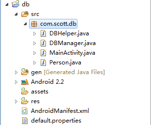
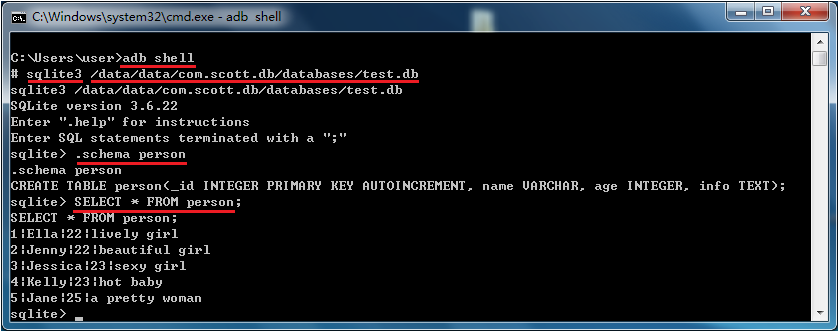

本篇文章为转载，原文地址：[http://blog.csdn.net/liuhe688/article/details/6715983](http://blog.csdn.net/liuhe688/article/details/6715983)

#  Android中SQLite应用详解

上次我向大家介绍了SQLite的基本信息和使用过程，相信朋友们对SQLite已经有所了解了，那今天呢，我就和大家分享一下在Android中如何使用SQLite。

现在的主流移动设备像Android、iPhone等都使用SQLite作为复杂数据的存储引擎，在我们为移动设备开发应用程序时，也许就要使用到SQLite来存储我们大量的数据，所以我们就需要掌握移动设备上的SQLite开发技巧。对于Android平台来说，系统内置了丰富的API来供开发人员操作SQLite，我们可以轻松的完成对数据的存取。

下面就向大家介绍一下SQLite常用的操作方法，为了方便，我将代码写在了Activity的onCreate中：

    @Override
    protected void onCreate(Bundle savedInstanceState) {
        super.onCreate(savedInstanceState);
        
        // 打开或创建test.db数据库
        SQLiteDatabase db = openOrCreateDatabase("test.db", Context.MODE_PRIVATE, null);
        db.execSQL("DROP TABLE IF EXISTS person");
        // 创建person表
        db.execSQL("CREATE TABLE person (_id INTEGER PRIMARY KEY AUTOINCREMENT, name VARCHAR, age SMALLINT)");
        Person person = new Person();
        person.setName("john");
        person.setAge(30);
        // 插入数据
        db.execSQL("INSERT INTO PERSON VALUES (NULL, ?, ?)", new Object[]{person.getName(), person.getAge()});
        
        person.setName("david");
        person.setAge(40);
        // ContentValues以键值对的形式存放数据
        ContentValues cv = new ContentValues();
        cv.put("name", person.getName());
        cv.put("age", person.getAge());
        // 插入ContentValues中的数据
        db.insert("person", null, cv);
        
        cv = new ContentValues();
        cv.put("age", 35);
        //更新数据
        db.update("person", cv, "name = ?", new String[]{"john"});
    
        Cursor c = db.rawQuery("SELECT * FROM person WHERE age > ?", new String[]{"33"});
        while(c.moveToNext()) {
            int _id = c.getInt(c.getColumnIndex("_id"));
            String name = c.getString(c.getColumnIndex("name"));
            int age = c.getInt(c.getColumnIndex("age"));
            Log.i("db", "_id=>" + _id + ", name=>" + name + ", age=>" + age);
        }
        c.close();
        
        // 删除数据
        db.delete("person", "age < ?", new String[]{"35"});
        
        // 关闭数据库
        db.close();
        
        // 删除数据库
        // deleteDatabase("test.db");
    }
    
在执行完上面的代码后，系统就会在/data/data/[PACKAGE_NAME]/databases目录下生成一个“test.db”的数据库文件，如图：   
   
上面的代码中基本上囊括了大部分的数据库操作；对于添加、更新和删除来说，我们都可以使用
    
    db.executeSQL(String sql);
    // sql语句中使用占位符，然后第二个参数是实际的参数集
    db.executeSQL(String sql, Object[] bindArgs)
    
除了统一的形式之外，他们还有各自的操作方法：

    db.insert(String table, String nullColumnHack, ContentValues values);
    db.update(String table, ContentValues values, String whereClause, String[] whereArgs);
    db.delete(String table, String whereClause, String[] whereArgs);
    
　　以上三个方法的第一个参数都是表示要操作的表名；   
　　insert中的第二个参数表示如果插入的数据每一列都为空的话，需要指定此行中某一列的名称，系统将此列设置为NULL，不至于出现错误；   
　　insert中的第三个参数是ContentValues类型的变量，是键值对组成的Map，key代表列名，value代表该列要插入的值；   
　　update的第二个参数也很类似，只不过它是更新该字段key为最新的value值，第三个参数whereClause表示WHERE表达式，比如“age > ? and age < ?”等，最后的whereArgs参数是占位符的实际参数值；   
　　delete方法的参数也是一样。

 

下面来说说查询操作。查询操作相对于上面的几种操作要复杂些，因为我们经常要面对着各种各样的查询条件，所以系统也考虑到这种复杂性，为我们提供了较为丰富的查询形式：

    db.rawQuery(String sql, String[] selectionArgs);
    db.query(String table, String[] columns, String selection, String[] selectionArgs, String groupBy, String having, String orderBy);
    db.query(String table, String[] columns, String selection, String[] selectionArgs, String groupBy, String having, String orderBy, String limit);
    db.query(boolean distinct, String table, String[] columns, String selection, String[] selectionArgs, String groupBy, String having, String orderBy, String limit);
    
上面几种都是常用的查询方法，第一种最为简单，将所有的SQL语句都组织到一个字符串中，使用占位符代替实际参数，selectionArgs就是占位符实际参数集；下面的几种参数都很类似，columns表示要查询的列所有名称集，selection表示WHERE之后的条件语句，可以使用占位符，groupBy指定分组的列名，having指定分组条件，配合groupBy使用，orderBy指定排序的列名，limit指定分页参数，distinct可以指定“true”或“false”表示要不要过滤重复值。需要注意的是，selection、groupBy、having、orderBy、limit这几个参数中不包括“WHERE”、“GROUP BY”、“HAVING”、“ORDER BY”、“LIMIT”等SQL关键字。

最后，他们同时返回一个Cursor对象，代表数据集的游标，有点类似于JavaSE中的ResultSet。

下面是Cursor对象的常用方法：

    c.move(int offset);   // 以当前位置为参考，移动offset行
    c.moveToFirst();  // 移动到第一行
    c.moveToLast();   // 移动到最后一行
    c.moveToPosition(int position); // 移动到指定行
    c.moveToPrevious(); // 移动到前一行
    c.moveToNext(); // 移动到下一行
    c.isFirst(); // 是否指向第一行
    c.isLast(); // 是否指向最后一行
    c.isBeforeFirst(); // 是否指向第一条之前
    c.isAfterLast(); // 是否指向最后一条之后
    c.isNull(int columnIndex); // 指定列是否为空（列基数为0）
    c.isClosed(); // cursor是否已关闭
    c.getCount(); // 总项数
    c.getPosition(); // 返回游标当前指向的行标数
    c.getColumnIndex(String columnName); // 返回某列名的列索引值
    c.getString(int columnIndex); // 返回当前行指定列的值

在上面的代码示例中，已经用到了这几个常用方法中的一些，关于更多的信息，大家可以参考官方文档中的说明。

最后当我们完成了对数据库的操作后，记得调用SQLiteDatabase的close()方法释放数据库连接，否则容易出现SQLiteException。

上面就是SQLite的基本应用，但在实际开发中，为了能够更好的管理和维护数据库，**我们会封装一个继承自SQLiteOpenHelper类的数据库操作类，然后以这个类为基础，再封装我们的业务逻辑方法。**

下面，我们就以一个实例来讲解具体的用法，我们新建一个名为db的项目，结构如下：   

其中DBHelper继承了SQLiteOpenHelper，作为维护和管理数据库的基类，DBManager是建立在DBHelper之上，封装了常用的业务方法，Person是我们的person表对应的JavaBean，MainActivity就是我们显示的界面。

下面我们先来看一下DBHelper：

    package com.scott.db;
    
    import android.content.Context;
    import android.database.sqlite.SQLiteDatabase;
    import android.database.sqlite.SQLiteOpenHelper;
    
    public class DBHelper extends SQLiteOpenHelper {
        
        private static final String DATABASE_NAME = "test.db";
        private static final int DATABASE_VERSION = 1;
        
        public DBHelper(Context context) {
            // CursorFactory设置为null, 使用默认值
            suepr(context, DATABASE_NAME, null, DATABASE_VERSION);
        }
    
        // 数据库第一次创建时会调用
        @Override
        public void onCreate(SQLiteDatabase db) {
            db.execSQL("CREATE TABLE IF NOT EXISTS person(_id INTEGER PRIMARY KEY AUTOINCREMENT, name VARCHAR, age INTEGER, info TEXT)");
        }
        
        // 如果DATABASE_VERSION的值改为2，系统发现与现有的数据库版本不同，即会调用onUpgrade()
        @Override
        public void onUpgrade(SQLiteDatabase db, int oldVersion, int newVersion) {
            db.execSQL("ALTER TABLE person ADD COLUMN other STRING");
        }
    }
    
正如上面所述，数据库第一次创建时onCreate方法会被调用，我们可以执行创建表的语句，当系统发现版本变化之后，会调用onUpgrade方法，我们可以执行修改表结构等语句。

为了方便我们面向对象的使用数据，我们建一个Person类，对应person表中的字段，如下：

    package com.scott.db;
    
    public class Person {
        public int _id;
        public String name;
        public int age;
        public String info;
        
        public Person() {
        }
        
        public Person(String name, int age, String info) {
            this.name = name;
            this.age = age;
            this.info = info;
        }
    }
    
然后，我们需要一个DBManager，来封装我们所有的业务方法，代码如下：

    package com.soctt.db;
    
    import java.util.ArrayList;
    import java.util.List;
    
    import android.content.ContentValues;
    import android.content.Context;
    import android.database.Cursor;
    import android.database.sqlite.SQLiteDatabase;
    
    public class DBManager {
        private DBHelper helper;
        private SQLiteDatabase db;
        
        public DBManager(Context context) {
            helper = new DBHelper(context);
            // 因为getWritableDatabase()内部调用了mContext.openOrCreateDatabase(mName, 0, mFactory); 所以要确保context已初始化，我们可以把初始化DBManager的操作放在Activity的onCreate()中。
            db = helper.getWritableDatabase();
        }
        
        /**
         * add persons
         * @param persons
         */
        public void add(List<Person> persons) {
            db.beginTransaction(); // 开始事务
            try {
                for(Person person : persons) {
                    db.execSQL("INSERT INTO person VALUES (null, ?, ?, ?)", new Object[]{person.name, person.age, person.info});
                }
                db.setTransactionSuccessful(); // 设置事务成功完成
            } finally {
                db.endTransaction(); // 结束事务
            }
        }
        
        /**
         * update person's age
         * @param person
         */
        public void updateAge(Person person) {
            ContentValues cv = new ContentValues();
            cv.put("age", person.age);
            db.update("person", cv, "name = ?", new String[]{person.name});
        }
        
        /**
         * delete old person
         * @param person
         */
        public void deleteOldPerson(Person person) {
            db.delete("person", "age > ?", new String[]{String.valueOf(person.age)});
        }
        
        /**
         * query all persons, return list
         * @return List<Person>
         */
        public List<Person> query() {
            ArrayList<Person> persons = new ArrayList<Person>();
            Cursor c = queryTheCursor();
            while(c.moveToNext()) {
                Person person = new Person();
                person._id = c.getInt(c.getColumnIndex("_id"));
                person.name = c.getString(c.getColumnIndex("name"));
                person.age = c.getInt(c.getColumnIndex("age"));
                person.info = c.getString(c.getColumnIndex("info"));
                persons.add(person);
            }
            c.close();
            return persons;
        }
        
        /**
         * query all persons, return cursor
         * @return Cursor
         */
        public Cursor queryTheCursor() {
            Cursor c = db.rawQuery("SELECT * FROM person", null);
            return c;
        }
        
        /**
         * close database
         */
        public void closeDB() {
            db.close();
        }
    }
    
我们在DBManager构造方法中实例化DBHelper并获取一个SQLiteDatabase对象，作为整个应用的数据库实例；在添加多个Person信息时，我们采用了**事务处理，确保数据完整性**；最后我们提供了一个closeDB方法，**释放数据库资源**，这一个步骤在我们整个应用关闭时执行，这个环节容易被忘记，所以朋友们要注意。

我们获取数据库实例时使用了getWritableDatabase()方法，也许朋友们会有疑问，在getWritableDatabase()和getReadableDatabase()中，你为什么选择前者作为整个应用的数据库实例呢？在这里我想和大家着重分析一下这一点。   
我们来看一下SQLiteOpenHelper中的getReadableDatabase()方法：

    public synchronized SQLiteDatabase getReadableDatabase() {
        if (mDatabase != null && mDatabase.isOpen()) {
            // 如果发现mDatabase不为空并且已经打开则直接返回
            return mDatabase;
        }

        if (mIsInitializing) {
            // 如果正在初始化则抛出异常
            throw new IllegalStateException("getReadableDatabase called recursively");
        }

        // 开始实例化数据库mDatabase

        try {
            // 注意这里是调用了getWritableDatabase()方法
            return getWritableDatabase();
        } catch (SQLiteException e) {
            if (mName == null)
                throw e; // Can't open a temp database read-only!
            Log.e(TAG, "Couldn't open " + mName + " for writing (will try read-only):", e);
        }

        // 如果无法以可读写模式打开数据库 则以只读方式打开

        SQLiteDatabase db = null;
        try {
            mIsInitializing = true;
            String path = mContext.getDatabasePath(mName).getPath();// 获取数据库路径
            // 以只读方式打开数据库
            db = SQLiteDatabase.openDatabase(path, mFactory, SQLiteDatabase.OPEN_READONLY);
            if (db.getVersion() != mNewVersion) {
                throw new SQLiteException("Can't upgrade read-only database from version " + db.getVersion() + " to "
                        + mNewVersion + ": " + path);
            }

            onOpen(db);
            Log.w(TAG, "Opened " + mName + " in read-only mode");
            mDatabase = db;// 为mDatabase指定新打开的数据库
            return mDatabase;// 返回打开的数据库
        } finally {
            mIsInitializing = false;
            if (db != null && db != mDatabase)
                db.close();
        }
    }
    
在getReadableDatabase()方法中，首先判断是否已存在数据库实例并且是打开状态，如果是，则直接返回该实例，否则试图获取一个可读写模式的数据库实例，如果遇到磁盘空间已满等情况获取失败的话，再以只读模式打开数据库，获取数据库实例并返回，然后为mDatabase赋值为最新打开的数据库实例。既然有可能调用到getWritableDatabase()方法，我们就要看一下了：

    public synchronized SQLiteDatabase getWritableDatabase() {
        if (mDatabase != null && mDatabase.isOpen() && !mDatabase.isReadOnly()) {
            // 如果mDatabase不为空已打开并且不是只读模式 则返回该实例
            return mDatabase;
        }

        if (mIsInitializing) {
            throw new IllegalStateException("getWritableDatabase called recursively");
        }

        // If we have a read-only database open, someone could be using it
        // (though they shouldn't), which would cause a lock to be held on
        // the file, and our attempts to open the database read-write would
        // fail waiting for the file lock. To prevent that, we acquire the
        // lock on the read-only database, which shuts out other users.

        boolean success = false;
        SQLiteDatabase db = null;
        // 如果mDatabase不为空则加锁 阻止其他的操作
        if (mDatabase != null)
            mDatabase.lock();
        try {
            mIsInitializing = true;
            if (mName == null) {
                db = SQLiteDatabase.create(null);
            } else {
                // 打开或创建数据库
                db = mContext.openOrCreateDatabase(mName, 0, mFactory);
            }
            // 获取数据库版本(如果刚创建的数据库,版本为0)
            int version = db.getVersion();
            // 比较版本(我们代码中的版本mNewVersion为1)
            if (version != mNewVersion) {
                db.beginTransaction();// 开始事务
                try {
                    if (version == 0) {
                        // 执行我们的onCreate方法
                        onCreate(db);
                    } else {
                        // 如果我们应用升级了mNewVersion为2,而原版本为1则执行onUpgrade方法
                        onUpgrade(db, version, mNewVersion);
                    }
                    db.setVersion(mNewVersion);// 设置最新版本
                    db.setTransactionSuccessful();// 设置事务成功
                } finally {
                    db.endTransaction();// 结束事务
                }
            }

            onOpen(db);
            success = true;
            return db;// 返回可读写模式的数据库实例
        } finally {
            mIsInitializing = false;
            if (success) {
                // 打开成功
                if (mDatabase != null) {
                    // 如果mDatabase有值则先关闭
                    try {
                        mDatabase.close();
                    } catch (Exception e) {
                    }
                    mDatabase.unlock();// 解锁
                }
                mDatabase = db;// 赋值给mDatabase
            } else {
                // 打开失败的情况：解锁、关闭
                if (mDatabase != null)
                    mDatabase.unlock();
                if (db != null)
                    db.close();
            }
        }
    }
    
大家可以看到，几个关键步骤是，首先判断mDatabase如果不为空已打开并不是只读模式则直接返回，否则如果mDatabase不为空则加锁，然后开始打开或创建数据库，比较版本，根据版本号来调用相应的方法，为数据库设置新版本号，最后释放旧的不为空的mDatabase并解锁，把新打开的数据库实例赋予mDatabase，并返回最新实例。

看完上面的过程之后，大家或许就清楚了许多，如果不是在遇到磁盘空间已满等情况，getReadableDatabase()一般都会返回和getWritableDatabase()一样的数据库实例，所以我们在DBManager构造方法中使用getWritableDatabase()获取整个应用所使用的数据库实例是可行的。当然如果你真的担心这种情况会发生，那么你可以先用getWritableDatabase()获取数据实例，如果遇到异常，再试图用getReadableDatabase()获取实例，当然这个时候你获取的实例只能读不能写了。

最后，让我们看一下如何使用这些数据操作方法来显示数据，下面是MainActivity.java的布局文件和代码：

	<?xml version="1.0" encoding="utf-8"?>
	<LinearLayout xmlns:android="http://schemas.android.com/apk/res/android"
	    android:orientation="vertical"
	    android:layout_width="fill_parent"
	    android:layout_height="fill_parent">
	    <Button
	        android:layout_width="fill_parent"
	        android:layout_height="wrap_content"
	        android:text="add"
	        android:onClick="add"/>
	    <Button
	        android:layout_width="fill_parent"
	        android:layout_height="wrap_content"
	        android:text="update"
	        android:onClick="update"/>
	    <Button
	        android:layout_width="fill_parent"
	        android:layout_height="wrap_content"
	        android:text="delete"
	        android:onClick="delete"/>
	    <Button
	        android:layout_width="fill_parent"
	        android:layout_height="wrap_content"
	        android:text="query"
	        android:onClick="query"/>
	    <Button
	        android:layout_width="fill_parent"
	        android:layout_height="wrap_content"
	        android:text="queryTheCursor"
	        android:onClick="queryTheCursor"/>
	    <ListView
	        android:id="@+id/listView"
	        android:layout_width="fill_parent"
	        android:layout_height="wrap_content"/>
	</LinearLayout>

　

	package com.scott.db;
	
	import java.util.ArrayList;
	import java.util.HashMap;
	import java.util.List;
	import java.util.Map;
	
	import android.app.Activity;
	import android.database.Cursor;
	import android.database.CursorWrapper;
	import android.os.Bundle;
	import android.view.View;
	import android.widget.ListView;
	import android.widget.SimpleAdapter;
	import android.widget.SimpleCursorAdapter;
	
	
	public class MainActivity extends Activity {
	   
		private DBManager mgr;
		private ListView listView;
		
	    @Override
	    public void onCreate(Bundle savedInstanceState) {
	        super.onCreate(savedInstanceState);
	        setContentView(R.layout.main);
	        listView = (ListView) findViewById(R.id.listView);
	        //初始化DBManager
	        mgr = new DBManager(this);
	    }
	    
	    @Override
	    protected void onDestroy() {
	    	super.onDestroy();
	    	//应用的最后一个Activity关闭时应释放DB
	    	mgr.closeDB();
	    }
	    
	    public void add(View view) {
	    	ArrayList<Person> persons = new ArrayList<Person>();
	    	
	    	Person person1 = new Person("Ella", 22, "lively girl");
	    	Person person2 = new Person("Jenny", 22, "beautiful girl");
	    	Person person3 = new Person("Jessica", 23, "sexy girl");
	    	Person person4 = new Person("Kelly", 23, "hot baby");
	    	Person person5 = new Person("Jane", 25, "a pretty woman");
	    	
	    	persons.add(person1);
	    	persons.add(person2);
	    	persons.add(person3);
	    	persons.add(person4);
	    	persons.add(person5);
	    	
	    	mgr.add(persons);
	    }
	    
	    public void update(View view) {
	    	Person person = new Person();
	    	person.name = "Jane";
	    	person.age = 30;
	    	mgr.updateAge(person);
	    }
	    
	    public void delete(View view) {
	    	Person person = new Person();
	    	person.age = 30;
	    	mgr.deleteOldPerson(person);
	    }
	    
	    public void query(View view) {
	    	List<Person> persons = mgr.query();
	    	ArrayList<Map<String, String>> list = new ArrayList<Map<String, String>>();
	    	for (Person person : persons) {
	    		HashMap<String, String> map = new HashMap<String, String>();
	    		map.put("name", person.name);
	    		map.put("info", person.age + " years old, " + person.info);
	    		list.add(map);
	    	}
	    	SimpleAdapter adapter = new SimpleAdapter(this, list, android.R.layout.simple_list_item_2,
	    				new String[]{"name", "info"}, new int[]{android.R.id.text1, android.R.id.text2});
	    	listView.setAdapter(adapter);
	    }
	    
	    public void queryTheCursor(View view) {
	    	Cursor c = mgr.queryTheCursor();
	    	startManagingCursor(c);	//托付给activity根据自己的生命周期去管理Cursor的生命周期
	    	CursorWrapper cursorWrapper = new CursorWrapper(c) {
	    		@Override
	    		public String getString(int columnIndex) {
	    			//将简介前加上年龄
	    			if (getColumnName(columnIndex).equals("info")) {
	    				int age = getInt(getColumnIndex("age"));
	    				return age + " years old, " + super.getString(columnIndex);
	    			}
	    			return super.getString(columnIndex);
	    		}
	    	};
	    	//确保查询结果中有"_id"列
			SimpleCursorAdapter adapter = new SimpleCursorAdapter(this, android.R.layout.simple_list_item_2, 
					cursorWrapper, new String[]{"name", "info"}, new int[]{android.R.id.text1, android.R.id.text2});
			ListView listView = (ListView) findViewById(R.id.listView);
			listView.setAdapter(adapter);
	    }
	}
	
这里需要注意的是SimpleCursorAdapter的应用，当我们使用这个适配器时，我们必须先得到一个Cursor对象，这里面有几个问题：如何管理Cursor的生命周期，如果包装Cursor，Cursor结果集都需要注意什么。

如果手动去管理Cursor的话会非常的麻烦，还有一定的风险，处理不当的话运行期间就会出现异常，幸好Activity为我们提供了startManagingCursor(Cursor cursor)方法，它会根据Activity的生命周期去管理当前的Cursor对象，下面是该方法的说明：

	/**
	 * This method allows the activity to take care of managing the given
	 * {@link Cursor}'s lifecycle for you based on the activity's lifecycle.
	 * That is, when the activity is stopped it will automatically call
	 * {@link Cursor#deactivate} on the given Cursor, and when it is later restarted
	 * it will call {@link Cursor#requery} for you.  When the activity is
	 * destroyed, all managed Cursors will be closed automatically.
	 * 
	 * @param c The Cursor to be managed.
	 * 
	 * @see #managedQuery(android.net.Uri , String[], String, String[], String)
	 * @see #stopManagingCursor
	 */
	 
文中提到，startManagingCursor方法会根据Activity的生命周期去管理当前的Cursor对象的生命周期，就是说当Activity停止时他会自动调用Cursor的deactivate方法，禁用游标，当Activity重新回到屏幕时它会调用Cursor的requery方法再次查询，当Activity摧毁时，被管理的Cursor都会自动关闭释放。

如何包装Cursor：我们会使用到CursorWrapper对象去包装我们的Cursor对象，实现我们需要的数据转换工作，这个CursorWrapper实际上是实现了Cursor接口。我们查询获取到的Cursor其实是Cursor的引用，而系统实际返回给我们的必然是Cursor接口的一个实现类的对象实例，我们用CursorWrapper包装这个实例，然后再使用SimpleCursorAdapter将结果显示到列表上。

**Cursor结果集需要注意些什么：一个最需要注意的是，在我们的结果集中必须要包含一个“\_id”的列，否则SimpleCursorAdapter就会翻脸不认人，为什么一定要这样呢？因为这源于SQLite的规范，主键以“\_id”为标准。**

解决办法有三：

1. **建表时根据规范去做；**
2. **查询时用别名，例如：SELECT id AS \_id FROM person；**
3. **在CursorWrapper里做文章。如果试图从CursorWrapper里获取“_id”对应的列索引，我们就返回查询结果里“id”对应的列索引即可。**

		CursorWrapper cursorWrapper = new CursorWrapper(c) {
			@Override
			public int getColumnIndexOrThrow(String columnName) throws 		IllegalArgumentException {
				if (columnName.equals("_id")) {
					return super.getColumnIndex("id");
				}
				return super.getColumnIndexOrThrow(columnName);
			}
		};

最后我们来看一下结果如何：   

