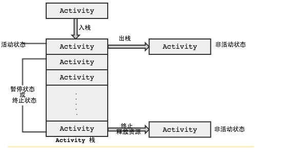
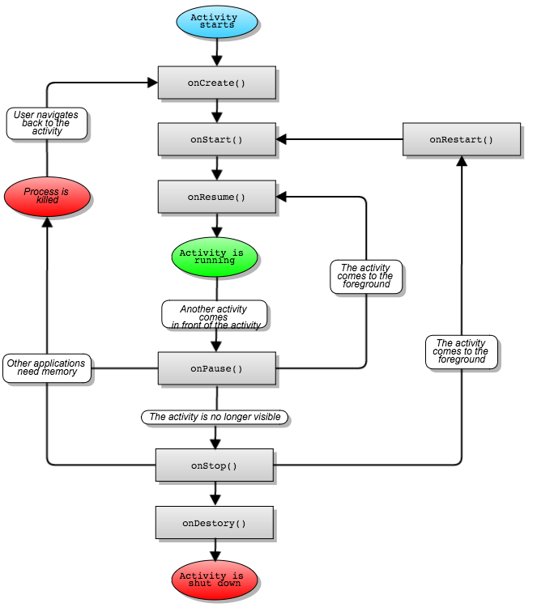
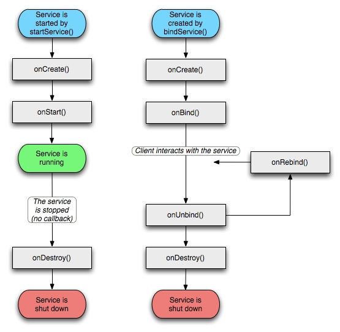

本篇文章为转载，原文地址：[Android四大基本组件介绍与生命周期](http://www.cnblogs.com/bravestarrhu/archive/2012/05/02/2479461.html)

# Android四大基本组件介绍与生命周期

Android四大基本组件分别是[`Activity`](#activity)，[`Service服务`](#service)，[`ContentProvider内容提供者`](#contentprovider)，[`BroadcastReceiver广播接收者`](#broadcastreceiver)

### **一：了解四大基本组件**

#### [Activity](id:activity):

应用程序中，一个Activity通常就是一个单独的屏幕，它上面可以显示一些控件也可以监听处、理用户的事件并做出响应。

Activity之间通过`Intent`进行通信。

在Intent的描述结构中，有两个最重要的部分：__动作和动作对应的数据__。

典型的动作类型有：MAIN（activity 的门户）,VIEW,PICK,EDIT等。而动作对应的数据则以URI的形式进行表述。例如：要查看一个人的联系方式，你需要创建一个动作类型为VIEW的Intent，以及一个表示这个人的URI。

与之有关系的一个类叫`IntentFilter`，相对于Intent是一个有效的做某事的请求，一个intentfilter则用于描述一个activity(或者IntentReceiver)，能够操作哪些Intent。一个acitivity如果要显示一个人的联系方式时，需要声明一个IntentFilter，这个IntentFilter要知道怎么去处理VIEW动作和表示一个人的URI。

IntentFilter需要在`AndroidManifest.xml`中定义。通过解析各种Intent，从一个屏幕导航到另一个屏幕是很简单的。当向前导航时，activity将会调用`startActivity(Intent myIntent)`方法。然后，系统会在所有安装的应用程序中定义的IntentFilter中查找，找到最匹配`myIntent`的IntentFilter对应的Activity。新的Activity接到myIntent的通知后，开始运行。

**当`startActivity`方法被调用将触发解析`myIntent`的动作，这个机制提供了两个关键的好处：**

+ **Activities能够重复利用从其他组件中以Intent的形式产生的一个请求；**
+ **Activities可以在任何时候被一个具有相同的IntentFilter的新的Activity取代。**

AndroidManifest文件中含有如下过滤器的Activity组件为默认启动类，当程序启动时，系统自动调用它
	
	<intent-filter>
		<action android:name="android.intent.action.MAIN" />
		<category android:name="android.intent.category.LAUNCHER" />
	</intent-filter>
	
#### [BroadcastReceiver广播接收器](id:broadcastreceiver)：

你的应用可以使用它对外部事件进行过滤只对感兴趣的外部事件（如当电话呼入时，或者数据网络可用时）进行接收并做出响应。广播接收器没有界面，但是它可以启动一个Activity或者Service来处理它接收的消息，或用NotificationManager来通知用户。通知可以用多种方式来吸引用户的注意力－闪动背光、震动、播放声音等。一般来说，是在通知栏上放一个持久的图标，用户可以打开它并获取消息。

##### 广播类型

+ **普通广播**  
  　　通过`Context.sendBroadcast(Intent myIntent)`发送的。
+ **有序广播**  
  　　通过`Context.sendOrderedBroadcast(intent, receiverPermission)`发送的，~~该方法第二个参数决定该广播的级别，级别数值是在－1000到1000之间，值越大，发送的优先级越高~~（关于第二个参数receiverPermission此处的描述有误，API文档描述是：(optional) String naming a permissions that a receiver must hold in order to receive your broadcast. If null, no permission is required.）；广播接收者接收广播的级别（可通过intentfilter中的priority进行设置，设为2147483647时优先级最高），同级别接受的先后是随机的，再到级别低的接受收到广播，高级别的或同级别先接受到广播的可以通过`abortBroadcast()`方法截断广播使其他接收者无法收到该广播。
+ **~~异步广播~~（此处译为"_持久广播_ " | "_粘性广播_ " 较好）**  
　　通过`Context.sendStickyBroadcast(Intent myIntent)`发送的，还有`sendStickyOriderBroadcast(intent, resultReceiver, scheduler, initialCode, initialData, initialExtras)`方法，该方法具有有序广播的特性也有异步广播的特性；发送异步广播需要app注册`<uses-permission android:name="android.permission.BROADCAST_STICKY" />`权限，接受并处理完Intent后，该广播依然存在，直到你调用`removeStickyBroadcast(intent)`主动把它去掉。

**注意**：_发送广播时的intent参数与Context.startActivity(intent)启动起来的intent不同，前者可以被多个订阅它的广播接收器调用，后者只能被一个（activity或service）调用。_

##### 监听广播Intent步骤

 1. 写一个继承`BroadcastReceiver`的类，重写`onReceive()`方法，广播接收器仅在它执行这个方法时处于活跃状态。当`onReceive()`返回后，它既为失活状态。**注意：为了保证用户交互过程的流畅，~~一些费时的操作要放到线程里，如类名SMSBroadcastReceiver。~~**（**此处建议是启动一个Service完成耗时的操作，不应考虑使用新线程。**_因为，BroadcastReciever本身周期很短，可能出现的情况是子线程还没有结束，BroadcastReceiver就已经退出了；另一种可能的情况是，如果BroadcastReceiver所在的线程结束，虽然该进程内还有用户启动的新线程，但如果该进程内不包含任何活动组件，因此系统可能在内存紧张时优先结束该进程，这样就可能导致BroadcastReceiver启动的子线程不能执行完成。_）

 2. 注册该广播接收者。注册有两种方法 __程序动态注册__ 和 __AndroidMainifest文件中静态注册__（可理解为系统注册）如下：
 
    **静态注册**  
    AndroidManifest.xml中注册，下面的priority表示广播接收者优先级，“2147483647”为最高优先级。
    
    	<receiver android:name=".SMSBroadcastReceiver">
    		<intent-filter android:priority="2147483647">
    			<action android:name="android.provider.Telephony.SMS_RECEIVED" />
    		</intent-filter>
    	</receiver>
    
   	**动态注册**  
   	一般在Activity可交互时(onResume()内)注册BroadcastReceiver。
   	
   		IntentFilter intentfilter = new IntentFilter("android.provider.Telephony.SMS_RECEIVED");
   		registerReceiver(mBatteryInfoReceiver, intentfilter);
   		
   		// 取消注册
   		unregisterReceiver(receiver);
   		

**注意**：

 1. BroadcastReceiver生命周期只有10s左右。 如果在 onReceive()中做超过10s的事情，就会报ANR(Application No Response)程序无响应错误信息，如果需要完成一个很耗时的操作，应该启动Service，由Service来完成。这里不能用子线程来解决，因为BroadcastReceiver的生命周期很短，子线程可能还没有结束BroadcastReceiver就先结束了。BroadcastReceiver一旦结束，此时BroadcastReceiver的所在进程很容易在系统需要内存时被优先杀死，因为它属于空进程（没有任何活动组件的进程）。如果它的宿主进程被杀死，那么正在工作对子线程也会被杀死。所以采用子线程来解决是不可靠的。
 
 2. 动态注册广播接收器还有一个特点，~~就是当用来注册的Activity关掉后，广播也就失效了~~（此处描述有误，注册广播接收器的Activity关闭之前需要取消注册，否则会抛出异常）。静态注册无需担忧广播接收器是否被关闭，只要设备是开启的，广播接收器也是打开的。也就是说哪怕app本身未启动，该app订阅的广播在触发时也会对它起作用。

#### [Service服务](id:service)

一个Service是一段长生命周期的，没有用户界面的程序，可以用来开发如监控类程序。

比较好的一个例子就是一个正在从播放列表中播放歌曲的媒体播放器。在一个媒体播放器的应用中，应该会有多个activity，让用户可以选择歌曲并播放歌曲。然而，音乐重放这个功能并没有对应的activity，因为使用者当然会认为在导航到其他屏幕时音乐应该还在播放的。在这个例子中，媒体播放器这个activity会使用Context.startService()来启动一个Service，从而可以在后台保持音乐的播放。同时，系统也将保持这个Service一直执行，直到Service运行结束。另外，我们还可以通过使用Context.bindService()方法，连接到一个Service上（如果这个Service还没用运行将启动它）。当连接到一个Service之后，我们还可以通过service提供的接口与它进行通讯。拿媒体播放器这个例子来说，我们还可以进行暂停、重播等操作。

Service创建步骤如下：

 1. 继承Service类
 
 2. AndroidManifest.xml配置清单文件中\<application> 节点里对服务进行配置。
 	
		<service android:name=".CustomService" />
		
服务不能自己运行，需要通过Context.startService()或Context.bindService()来启动服务。

通过startService()方法启动的服务跟调用者没有关系，即使调用者关闭了，服务仍然运行。想停止服务，要调用Context.stopService()，此时系统会调用onDestory()。使用此方法启动的服务，服务首次运行时会依次调用Service的onCreate()->onStart()，如果服务已经启动了再次调用启动服务，只会触发onStart()方法。

使用bindService()启动的服务与调用者绑定，只要调用者关闭服务就终止，使用此方法启动时，服务首次启动时系统会调用服务的onCreate()->onBind()，如果服务已经启动再次调用不会触发这2个方法，调用者退出时系统会调用服务的onUnbind()->onDestroy()，想主动解除绑定可使用Context.unbindService()，系统依次调用onUnbind()->onDestroy()；

**（注意：bindService方法启动的服务，调用者没有调用unBindService()而直接关闭，应用会抛出异常；多个调用方多次调用bindService()，Service的onBind()方法只会运行一次，而不同于onStart()、onStartCommand()。）**

#### [Content Provider 内容提供者](id:contentprovider)

android平台提供了Content Provider使一个应用程序可以指定数据集提供给其他应用程序。这些数据可以存储在文件系统中、在一个SQLite数据库、或以任何其他合理的方式。

其他应用可以通过ContentResolver类（见ContentProviderAccessApp例子）从该内容提供者那里获取或存入数据（相当于在应用外包一层壳）。

只有需要在多个应用程序间共享数据时才需要内容提供者。例如：通讯录数据被多个应用程序使用，且必须存储在一个内容提供者中。

它的好处：**统一数据访问方式**。

android系统自带的内容提供者（顶级的表示数据库名，非顶级的表示表名）这些内容提供者在SDK文档的
android.provider Java包中都有介绍。见：[http://developer.android.com/reference/android/provider/package-summary.html](http://developer.android.com/reference/android/provider/package-summary.html)

|------Browser  
|------CallLog  
|------Contacts  
|---------|-------Groups  
|---------|-------People  
|---------|-------Phones  
|---------|-------Photos  
|------Images  
|---------|-------Thumbnails  
|------MediaStore  
|---------|-------Albums  
|---------|-------Artists  
|---------|-------Audio  
|---------|-------Genres  
|---------|-------Playlists  
|------Settings  
|------Video

CallLog：地址和接收到的电话信息  
Contact.People.Phones：存储电话号码  
Setting.System：系统设置和偏好设置

###### 使用ContentProvider对外共享数据的方式：

###### 1. 继承ContentProvider类并根据需要重写以下方法：
 
		public boolean onCreate(); // 处理初始化操作
		
		/**
		* 插入数据到内容提供者（允许其它应用向你的应用中插入数据时重写）
		* @param uri
		* @param initialValues 插入的数据
		* @return
		*/
		public Uri insert(Uri uri, ContentValues initialValues);
		
		/**
		* 从内容提供者中删除数据（允许其它应用删除你应用的数据时重写）
		* @param uri
		* @param selection 条件语句
		* @param selectionArgs 条件语句参数
		* @return
		*/
		public int delete(Uri uri, String selection, String[] selectionArgs);
		
		/**
		* 更新内容提供者已存在的数据（允许其它应用更新你应用的数据时重写）
		* @param uri
		* @param values 更新的数据
		* @param selection 条件语句
		* @param selectionArgs 条件语句参数
		* @return
		*/
		public int update(Uri uri, ContentValues values, String selection, String[] selectionArgs);
		
		/**
		* 返回数据给调用者（允许其它应用从你的应用中获取数据）
		* @param uri
		* @param projection 列名
		* @param selection 条件语句
		* @param selectionArgs 条件语句参数
		* @param sortOrder 排序方式
		* @return
		*/
		public Cursor query(Uri uri, String[] projection, String selection, String[] selectionArgs, String sortOrder);
		
		/**
		* 用于返回当前Uri所代表数据的MIME类型
		* 如果操作对数据为集合类型（多条数据），那么返回的类型字符串应该为vnd.android.cursor.dir/开头
		* 例如：要得到所有person纪录的Uri为content://com.bravestarr.provider.personprovider/person，那么返回的MIME类型字符串应该为“vnd.android.cursor.dir/person”
		* 如果操作的数据为单一数据，那么返回的类型字符串应该为vnd.android.cursor.item/开头
		* 例如：要得到id为10的person纪录的Uri为content://com.bravestarr.provider.personprovider/person/10，那么返回的MIME类型字符串应该为“vnd.android.cursor.item/person”
		* @param uri
		*/
		public String getType(Uri uri);
		

这些方法中的Uri参数，得到后需要进行解析然后做对应的处理，Uri表示要操作的数据，包含两部分信息：

 1. 需要操作的contentprovider
 2. 对contentprovider中的什么数据进行操作，一个Uri格式，结构头://authorities（域名）/路径（要操作的数据，根据业务而定）   
 		
		content://com.bravestarr.provider.personprovider/person/10
		
说明：   
contentprovider的结构头已经由android规定为content://   
authorities用于唯一标识这个contentprovider程序，外部调用者可以根据这个找到它   
路径表示我们要操作的数据，路径的构建根据业务而定。路径的格式如下：   
 
 + 要操作person表行号为10的纪录可以这样构建/person/10
 + 要操作person表的所有纪录，可以这样构建/person
   
###### 2. AndroidMainfest.xml注册contentprovider

在AndroidMainfest.xml中使用`<provider>`对ContentProvider进行配置注册（内容提供者注册它自己就像网站注册域名），ContentProvider采用authorities（原意授权，可理解为域名）作为唯一标识，方便其他应用能找到。

	<application
		android:icon="@drawable/ic_laucher"
		android:label="@string/app_name" >
		
		<!-- authorities属性命名建议：公司名.provider.SomeProvider -->
		<provider android:name=".PersonProvider" android:authorities="com.bravestarr.provider.personprovider" />
	</application>
	
	
#### 关于四大基本组件的一点总结

##### 1> 四大组件的注册

四大基本组件都需要注册才能使用。

每个Activity、Service、ContentProvider都需要在AndroidManifest.xml中配置。AndroidManifest中未声明的activity、服务、内容提供者将不为系统所见，从而也就不可使用，而BroadcastReceiver的注册分为静态注册（在AndroidManifest.xml中进行配置）和通过代码动态创建并以调用Context.registerReceiver()的方式注册到系统。需要注意的是在AndroidManifest文件中进行配置的BroadcastReceiver会随系统到启动而一直处于活跃状态，只要接收到感兴趣的广播就会触发（即使程序未运行）

AndroidManifest.xml文件中注册格式如下：

`<activity>`元素的name指定了实现了这个activity的Activity的子类。icon和label属性指向了包含展示给此用户的此activity的图标和标签的资源文件。

`<service>`元素用于声明服务

`<receiver>`元素用于声明广播接收器

`<provider>`元素用于声明内容提供者

##### 2> 四大组件的激活

+ 内容提供者的激活：当接收到`ContentResolver`发出的请求后，内容提供者被激活。而其它三种组件－activity、服务和广播接收器被一种叫intent的异步消息激活。

+ Activity的激活：通过传递一个Intent对象至Context.startActivity()或Context.startActivityForResult()以载入（或指定新工作给）一个activity。相应的activity可以通过`getIntent()`方法来查看激活它的intent。如果它期望它所启动的那个activity返回一个结果，它会以调用startActivityForResult()来取代startActivity()。比如说，如果它启动了另外一个activity以使用户挑选一张照片，它也许想知道哪张照片被选中了。结果会被封装到一个Intent对象中，并传递给发出调用的activity的`onActivityResult()`方法。

+ 服务的激活：可以通过传递一个Intent对象至Context.startService()或Context.bindService()，前者Android调用服务的onStart()方法并将Intent对象传递给他，后者Android调用服务的onBind()方法并将这个Intent对象传递给它。

+ 发送广播可以通过传递一个Intent对象至Context.sendBroadcast()、Context.sendOrderedBroadcast()或Context.sendStickyBroadcast()。Android会调用所有对此广播感兴趣的广播接收器的onReceive()方法，将intent传递给它们。

##### 3> 四大组件的关闭

内容提供者仅在响应ContentResolver提出请求时激活。而一个广播接收器仅在响应广播信息的时候激活。所以，没有必要去显示的关闭这些组件。

Activity的关闭，可以通过调用它的finish()方法来关闭这个activity。

服务关闭，对于通过startService()方法启动的服务要调用Context.stopService()方法关闭服务，使用Context.bindService()方法启动的服务要调用Context.unbindService()方法关闭服务。

### 二：四大组件生命周期

介绍生命周期之前，先提一下任务的概念

任务其实就是activity的栈。它由一个或多个Activity组成的共同完成一个完整的用户体验，换句话说任务就是“应用程序”（可以是一个也可以是多个，比如假设你想让用户看到某个地方的街道地图，而已经存在一个具有此功能的Activity了，那么你的activity所需要做的工作就是把请求信息放到一个Intent对象里面，并把它传递给startActivity()，于是地图浏览器就会显示那个地图。而当用户按下BACK键的时候，你的activity又会再一次显示在屏幕上，此时任务是由2个应用程序中相关的activity组成的）栈底的是启动整个任务的Activity，栈顶的是当前运行的用户可以交互的Activity，当启动另外一个Activity的时候，新的activity被压入栈，并成为当前运行的activity。而前一个activity仍保持在栈中。当用户按下BACK键的时候，当前activity出栈，而前一个恢复为当前运行的activity。栈中保存的其实是对象，栈中的activity永远不会重排，只会压入或弹出，所以如果发生了诸如需要多个地图浏览器的情况，就会使得一个任务中出现多个同一Activity的实例同时存在。

任务中的所有activity是作为一个整体进行移动的。整个任务（既activity栈）可以移到前台，或退至后台。举个栗子，比如当前任务在栈中存有四个activity－三个在当前activity之下。当用户按下HOME键时，回到了应用程序加载器，然后选择了一个新的应用程序（也就是一个新任务）。则当前任务遁入后台，而新任务的根activity显示出来了。然后，过了一小会，用户再次回到了应用程序加载器而又选择了前一个应用程序（上一个任务）。于是那个任务，带着它的4个activity，再一次的到了前台。当用户按下BACK键的时候，屏幕不会显示出用户刚离开的activity（上一个任务的根activity）。取而代之，当前任务的栈中最上面的activity被弹出，而同一任务的上一个activity显示了出来。

Activity栈：先进后出规则

Android系统是一个多任务（Multi-Task）的操作系统，可以在用手机听音乐的同时，也执行其他应用程序。每多执行一个应用程序，就会多耗费一些系统内存，当同时执行的程序过多，或是关闭的程序没有正确释放掉内存，系统就会越来越慢，甚至不稳定。

为了解决这个问题，Android引入了一个新的机制－生命周期（Life Cycle）。

Android应用程序的生命周期是由Android框架进行管理，而不是由应用程序直接控制。通常，每一个应用程序（入口一般会是一个Activity的onCreate()方法），都会产生一个进程（Process）。当系统内存即将不足时候，会依照优先级自动进行进程（process）的回收。不管是使用者或是开发者，都无法确定应用程序何时会被回收。所以为了很好防止数据丢失和其他问题，了解生命周期很重要。

**Android生命周期**

*Activity整个生命周期的4种状态、7个重要方法和3个嵌套循环*

*1> 四种状态*

1. 活动（Active/Running）状态   
   当Activity运行在屏幕前台（处于当前活动栈的最上层），此时它获取了焦点能响应用户的操作，属于运行状态，同一时刻只会有一个Activity处于活动（Active）或运行（Running）状态。
   
2. 暂停（Paused）状态   
   当Activity失去焦点但仍对用户可见（如在它之上有另一个透明的Activity或Toast、AlertDialog等弹出窗口时）它处于暂停状态。暂停的Activity仍然是存活状态（它保留着所有的状态和成员信息并保持和窗口管理器的连接），但是当系统内存极小时可以被系统杀死。
   
3. 停止（Stopped）状态   
   完全被另一个Activity遮挡时处于停止状态，它仍然保留着所有的状态和成员信息。只是对用户不可见，当其他地方需要内存时往往会被系统杀死。
   
4. 非活动（Dead）状态   
   Activity尚未被启动、已经被手动终止，或已经被系统回收时处于非活动状态，要手动终止Activity，可以在程序中调用“finish”方法。
   
   如果是（按根据内存不足时的回收规则）被系统回收，可能是内存不足了
        
   内存不足时，Dalvak虚拟机会根据其内存回收规则来回收内存：
   
   1. 先回收与其他Activity或Service/Intent Receiver无关的进程（既优先回收独立的Activity）因此建议，我们一些（耗时）操作，最好是做成Service的形式。
   
   2. 不可见（处于Stopped状态）Activity
   
   3. Service进程（除非真的没有可用内存时会被销毁）
   
   4. 非活动的可见的（Paused状态）Activity
   
   5. 当前正在运行（Active或Running状态）Activity
   
*2> 7个重要方法。*   
当Activity从一种状态进入另一种状态时系统会自动调用下面相应的方法来通知用户这种变化。

当Activity第一次被实例化的时候系统会调用，整个生命周期只调用1次这个方法。通常用于初始化操作： 1、为Activity设置所要使用的布局文件。 2、为按钮绑定监听器等静态的设置操作。   
`onCreate(Bundle savedInstanceState);`

当Activity可见未获得用户焦点不能交互时系统会调用   
`onStart()`

当Activity已经停止然后重新被启动时系统会调用   
`onRestart()`

当Activity可见且获得用户焦点能交互时系统会调用   
`onResume()`

当系统启动另外一个新的Activity时，在新的Activity启动之前被系统调用保存现有的Activity中的持久数据、停止动画等，这个实现方法必须非常快。当系统而不是用户出于回收内存，关闭了Activity之后，用户会期望当他再次回到这个Activity的时候，它仍保持着上次离开的样子，此时用到了`onSaveInstanceState()`，方法onSaveInstanceState()用来保存Activity被杀之前的状态，必要时在onStop()前被触发，不确定是在onPause()之前还是之后，当系统为了节省内存销毁了Activity（用户本不想销毁）时，就需要重写这个方法，当此Activity再次被实例化时会通过onCreate(Bundle savedInstanceState)将已经保存对临时状态传入，因为onSaveInstanceState()方法不总是被调用，触发条件为（按下HOME键、按下电源键关闭屏幕、横竖屏切换），你应该仅重写onSaveInstanceState()来记录activity的临时状态，而不是持久数据。应该使用onPause()来存储持久数据。   
`onPause()`

当Activity被新的Activity完全覆盖不可见时被系统调用   
`onStop()`

当Activity（用户调用finish()或系统内存不足）被系统销毁杀掉时系统调用，（整个生命周期只调用1次）用来释放onCreate()方法中创建的资源，如结束线程等。   
`onDestroy()`

*3> 3个嵌套循环*

1. Activity完整的生命周期：从第一次调用onCreate()开始直到调用onDestroy()结束
2. Activity可视生命周期：从调用onStart()到相应的调用onStop()。   
   在这两个方法之间，可用保持显示Activity所需要的资源。如在onStart()中注册一个广播接收器监听影响你的UI的改变，在onStop()中注销。
3. Activity的前台生命周期：从调用onResume()到相应的调用onPause()。

 
举例说明：

 
例一：有3个Activity，分别用One, Two(透明的),Three表示。One是启动应用时的主Activity。

启动第一个界面Activity One时，它的次序是这样的：

onCreate(ONE) - onStart(ONE) - onResume(ONE)

点“打开透明Activity”按钮时，这次走的次序是

onPause(ONE) - onCreate(TWO) - onStart(TWO) - onResume(TWO)

再点BACK回到第一个界面，TWO会被杀死，这时走的次序是

onPause(TWO) - onActivityResult(ONE) - onResume(ONE) - onStop(TWO) - onDestroy(TWO)

点“打开全屏Activity”按钮时，这次走的次序是

onPause(ONE) - onCreate(THREE) - OnStart(THREE) - OnResume(THREE) - onStop(ONE)

再点back回到第一个界面，Three会被杀死，这时次序是

onPause(Three) - onActivityResult(One) - onRestart(One) - onStart(One) - onResume(One) - onStop(Three) - onDestroy(Three)

再点back退出应用时，它的次序是

onPause(One) - onStop(One) - onDestroy(One)

 
例二：横竖屏切换时Activity的生命周期

1. 新建一个Activity，并把各个生命周期打印出来

2. 运行Activity，得到如下信息   
   onCreate-->   
   onStart-->   
   onResume-->
   
3. 按ctrl+f12切换成横屏时   
   onSaveInstanceState-->   
   onPause-->   
   onStop-->   
   onDestroy-->   
   onCreate-->   
   onStart-->   
   onRestoreInstanceState-->   
   onResume-->
   
4. 再按ctrl+f12切换成竖屏时，发现打印了两次相同的log   
   onSaveInstanceState-->   
   onPause-->   
   onStop-->   
   onDestroy-->   
   onCreate-->   
   onStart-->  
   onRestoreInstanceState-->   
   onResume-->   
   onSaveInstanceState-->   
   onPause-->   
   onStop-->   
   onDestroy-->   
   onCreate-->   
   onStart-->   
   onRestoreInstanceState-->   
   onResume-->
   
5. 修改AndroidManifest.xml，把该Activity添加android:configChanges="orientation"，执行步骤3   
   onSaveInstanceState-->   
   onPause-->   
   onStop-->   
   onDestroy-->   
   onCreate-->   
   onStart-->   
   onRestoreInstanceState-->   
   onResume-->
   
6. 再执行步骤4，发现不会再打印相同信息，但多打印一行onConfigChanged   
   onSaveInstanceState-->   
   onPause-->   
   onStop-->   
   onDestroy-->   
   onCreate-->   
   onStart-->   
   onRestoreInstanceState-->   
   onResume-->   
   onConfigurationChanged-->
   
7. 把步骤5的android:configChanges="orientation"改成android:configChanges="orientation|keyboardHidden"，执行步骤3，就只打印onConfigChanged。   
   onConfigurationChanged-->
   
8. 执行步骤4   
   onConfigurationChanged-->   
   onConfigurationChanged-->

总结

1. 不设置Activity的android:configChanges时，切屏会重新调用各个生命周期，切横屏时会执行一次，切竖屏时会执行两次。

2. 设置Activity的android:configChanges="orientation"时，切屏还是会重新调用各个生命周期，切横、竖屏只会执行一次。

3. 设置Activity的android:configChanges="orientation|keyboardHidden"时，切屏不会重新调用各个生命周期，只会执行onConfigurationChanged方法。

（在Android3.2之前，只要声明android:configChanges="orientation|keyboardHidden"就可以防止Activity重建，但在Android3.2之后，横竖屏切换的时候，还会发生screen size change事件，因此就需要加入screenSize属性。`android:configChanges="orientation|keyboardHidden|screenSize"`）

 
总结一下整个Activity的生命周期：

当前Activity产生事件弹出Toast和AlertDialog的时候Activity生命周期不会改变。

Activity运行时按下HOME键（跟被完全覆盖是一样的）：onSaveInstanceState --> onPause --> onStop，再次进入激活状态时：onRestart --> onStart --> onResume

 
**BroadcastReceiver广播接收器生命周期**

BroadcastReceiver生命周期只有十秒左右，如果在onReceive()内做超过十秒的事情，就会报ANR(Application No Response)程序无响应错误。

它的生命周期从回调onReceive()方法开始到该方法返回结果后结束。

 
**Service服务生命周期**

Service完整的生命周期：从调用onCreate()开始直到调用onDestroy结束。

Service有两种使用方法：

1. 以调用Context.startService()启动，而以调用Context.stopService()结束
2. 以调用Context.bindService()启动，而以调用Context.unbindService()关闭。

Service重要的生命周期方法

当用户调用startService()或bindService()时，Service第一次被实例化的时候系统会调用，整个生命周期只会调用一次这个方法，通常用于初始化设置。**注意：多次调用startService()或bindService()不会多次触发onCreate()方法。**

	void onCreate()
	
当用户调用stopService()或unbindService()来停止服务时被系统调用，（整个生命周期只调用1次）用来释放onCreate()方法中创建的资源。

	void onDestroy()
	
通过startService()方法启动的服务：

　　初始化结束后系统会调用该方法，用于处理传递给startService()的Intent对象。如音乐服务会打开Intent来探明将要播放哪首音乐，并开始播放。**注意：多次调用startService()方法会多次触发onStartCommond()方法**

	void onStartCommand(Intent intent)
	
通过bindService()方法启动的服务：

　　初始化结束后系统会调用该方法，用来绑定传递给bindService()的Intent对象。**注意：多次调用bindService()时，如果该服务已启动则不会再触发此方法**

	IBinder onBind(Intent intent)
	
用户调用unbindService()时系统调用此方法，Intent对象同样传递给该方法。

	boolean onUnbind(Intent intent)
	
如果有新的客户端连接至该服务，只有当旧的调用onUnbind()后，新的才会调用该方法。

	void onRebind(Intent intent)
	

   

**补充**：

+ onCreate(Bundle savedInstanceState)与onSaveInstanceState(Bundle savedInstanceState)配合使用，见如下代码，达到显示activity被系统杀死前的状态。

		@Override
		protected void onCreate(Bundle savedInstanceState) {
			super.onCreate(savedInstanceState);
			if(null != savedIstanceState) {
				String userId = savedInstanceState.getString("KEY_USERID");
				String uId = savedInstanceState.getString("KEY_UID");
				String serverId = savedInstanceState.getString("KEY_SERVERID");
				String serverName = savedInstanceState.getString("KEY_SERVERNAME");
				int rate = savedInstanceState.getInt("KEY_RATE");
				
				// updateUserId(userId);
				// updateUId(uId);
				// updateServerId(serverId);
				// updateServerName(serverName);
				// updateRate(rate);
			}
		}
		
		@Override
		protected void onSaveInstanceState(Bundle savedInstanceState) {
			super.onSaveInstanceState(savedInstanceState);
			savedInstanceState.putString("KEY_USERID", getUserId());
			savedInstanceState.putString("KEY_UID", getUId());
			savedInstanceState.putString("KEY_SERVERID", getServerId());
			savedInstanceState.putString("KEY_SERVERNAME", getServerName());
			savedInstanceState.putInt("KEY_RATE", getRate());
		}
	
	
+ **引发activity摧毁和重建的其他情形。**   
<table><tr><td bgcolor="yellow">除了系统处于内存不足的原因会摧毁activity之外，某些系统设置的改变也会导致activity的摧毁和重建。例如：改变屏幕方向（见上例）、改变设备语言设定、键盘弹出等。</td></tr></table>