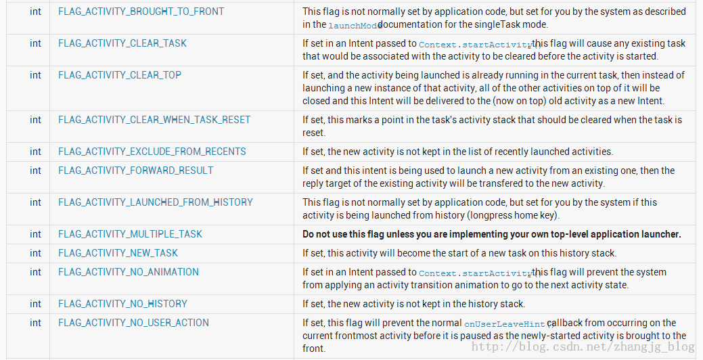

# [Intent Resolution](https://developer.android.com/guide/components/intents-filters.html#Resolution)

（翻译安卓官方文档）

如果一个Intent 可以通过多个activity或者filter的filter，那么用户将会被询问需要激活哪个组件。 如果一个都没有的话，将会抛出异常。

当系统接收到一个用来启动某个activity的隐式Intent（implicit intent）时，系统会通过注册的intent filter筛选方式查找到最符合该intent的activity，比较intent和intent filter会通过下面三个方面：

+ intent的action
+ intent的data（包括URI和data type）
+ intent的category

下面的几节描述了，按照组件在app manifest.xml文件中声明的intent-filter，intent怎么找到最匹配最合适的组件（component(s)）。

## Action test

一个intent-filter可以**声明0个或多个**`<action>`元素来指定接受intent的哪些actions。

例如：

	<intent-filter>
		<action android:name="android.intent.action.EDIT" />
		<action android:name="android.intent.action.VIEW" />
		...
	</intent-filter>

1. **如果要通过这个filter的测试，Intent的action必须匹配filter的某个action。**
2. **如果filter不包含任何action，那么任何intent都不能通过该filter。**
3. **~~However, if an Intent does not specify an action, it will pass the test (as long as the filter contains at least one action).~~（在模拟器上测试的时候发现：如果intent不指定action，filter包含一条action，报出异常。）**

## Category test

一个intent-filter可以**声明0个或多个**`<category>`元素来指定接受intent的哪些categories。

例如：

	<intent-filter>
		<category android:name="android.intent.category.DEFAULT" />
		<category android:name="android.intent.category.BROWSABLE" />
	</intent-filter>
	
1. 只有当Intent请求中所有的Category与组件中某一个IntentFilter的<category>完全匹配时，才会让该 Intent请求通过测试，IntentFilter中多余的<category>声明并不会导致匹配失败。   
**(filter.categorys containsAll intent.categorys)**

2. Androi会向传递给`startActivity()`和`startActivityForResult()`的隐式Intent添加`CATEGORY_DEFAULT`category，所以如果想要通过某intent-filter测试，需要给该intent-filter添加defaualt category。

## Data test

一个intent-filter可以**声明0个或多个**`<data>`元素来指定接受intent的哪些data。

例如：

	<intent-filter>
		<data android:mimeType="video/mpeg" android:scheme="http" ... />
		<data android:mimeType="audio/mpeg" android:scheme="http" ... />
		...
	</intent-filter>

每个`<data>`可以指定一个URI结构数据和一个data type（MIME media type）。有多个属性用来指定URI不同的部分：`scheme`,`host`,`port`,`path`。

	<scheme>://<host>:<port>/<path>
	
例如：

	content://com.example.project:200/floder/subfloder/etc
	
In this URI, the scheme is content, the host is com.example.project, the port is 200, and the path is folder/subfolder/etc.

 
这些属性都是可选的，但是却存在线性依赖：

+ 如果`scheme`没有指定，`host`会被忽略
+ 如果`host`没有指定，`port`会被忽略
+ 如果`scheme`,`host`都没有指定，`path`会被忽略

当在比较filter和intent的URI时，只会比较filter URI的部分。例如：

+ 如果filter只指定了scheme，那么所有符合这个scheme的URI都通过测试。

+ 如果filter指定了scheme和authority而没有指定path，那么所有的有相同的scheme和authority的URI通过filter测试，URI的path部分会被忽略。

+ 如果filter指定了scheme、authority、path，那么只有具有相同的scheme、authority、path的URI能通过filter的测试。   
_（注意⚠：filter的path可以包含通配符 __*__ ，只需要部分匹配即可）_

 
The data test compares both the URI and the MIME type in the intent to a URI and MIME type specified in the filter. The rules are as follows:

1. 如果一个intent 没有指定URI 和 data type , 那么如果filter中也是同样，则通过测试，否则，不通过。

2. 如果一个intent有URI但是没有 MIME type（既不明确指定也不能从URI推断出来），只能通过这样的filter: uri匹配, 并且不指定类型。（这种情况限于类似mailto:和tel:这样的不指定实际数据的uri）

3. 如果一个intent 包含 MIME type 但是没有 uri，那么 filter中列出相同的MIME type 并且没有指定URI 则通过测试。

4. 如果一个intent包含一个URI 和 MIME type（无论是明确指定或是从URI推断出来的），通过这样的filter测试：filter列出的有相同的 MIME type；intent的URI要么和filter中的URI匹配，要么intent的URI为`content:`或`file:`并且filter不指定URI。（换句话说，一个组件如果它的filter只列出了 MIME type，那么它会被默认为支持`content:`和`file:`类的数据。）

最后的那条规则（第4条），它反映出组件可以从一个file或者content provider 获取本地数据。因此，它们的filters 可以只设置data type而不必明确的将 scheme 命名为 `content:` 和 `file:` 。

这种情况是个特例，下面的 `<data>` 元素，列出了一个栗子，告诉android该组件可以从content provider中获取image data 并显示它。

	<intent-filter>
		<data android:mimeType="image/*" />
		...
	</intent-filter>

由于大部分可用的数据都是由content provider提供, 指定数据类型但不指定uri的filter是最常见的情况.

Another common configuration is filters with a scheme and a data type. For example, a <data> element like the following tells Android that the component can get video data from the network and display it:

另一种常见的配置是，filters指定了 scheme 和 data type。举个栗子，下面的 `<data>` 元素，告诉android该组件为了执行该动作可以从网上获取video数据。

	<intent-filter>
		<data android:scheme="http" android:type="video/*" />
		...
	</intent-filter>

（后续：考虑当用户在一个web page上点了一个链接后，浏览器应用程序做了什么。 它首先会试图去显示该数据（当做一个html页来处理）。如果它不能显示此数据，它会使用一个设置 scheme 和 data type 的隐式意图 去启动一个能显示此数据的activity。如果没有找到接受者，它会调用下载管理器去下载该数据，然后将其放在content provider的控制之下，这样很多activitys （那些之命名了data type）可以处理该数据）

  

---------------

  

下边文章为转载，原文地址：[http://blog.csdn.net/zhangjg_blog/article/details/10901293](http://blog.csdn.net/zhangjg_blog/article/details/10901293)

# Android系统中标准Intent的使用

## 一 Android系统用于Activity的标准Intent

1. 根据联系人ID显示联系人信息   

		Intent intent = new Intent();
		intent.setAction(Intent.ACTION_VIEW);   //显示联系人信息
		intent.setData(Uri.parse("content://contacts/people/492"));
		startActivity(intent);
		
2. 根据联系人ID显示拨号面板

		Intent intent = new Intent();
		intent.setAction(Intent.ACTION_DIAL);  //显示拨号面板
		intent.setData(Uri.parse("content://contacts/people/492"));
		startActivity(intent);
		
3. 显示拨号面板， 并在拨号面板上将号码显示出来

		Intent intent = new Intent();
		intent.setAction(Intent.ACTION_VIEW);   
		intent.setData(Uri.parse("tel://15216448315"));
		startActivity(intent);
		
4. 显示拨号面板， 并在拨号面板上将号码显示出来

		Intent intent = new Intent();
		//显示拨号面板, 并在拨号面板上将号码显示出来
		intent.setAction(Intent.ACTION_DIAL);
		intent.setData(Uri.parse("tel://15216448315"));
		startActivity(intent);
		
5. 根据联系人的ID编辑联系人

		Intent intent = new Intent();
		intent.setAction(Intent.ACTION_EDIT);   //编辑联系人
		intent.setData(Uri.parse("content://contacts/people/492"));
		startActivity(intent);

6. 显示通讯录联系人和其他账号联系人的列表

		Intent intent = new Intent();
		intent.setAction(Intent.ACTION_VIEW);   
		intent.setData(Uri.parse("content://contacts/people/"));
		startActivity(intent);
		
7. 启动HomeScreen

		Intent intent = new Intent();
		intent.setAction(Intent.ACTION_MAIN);     //启动HomeScreen
		intent.addCategory(Intent.CATEGORY_HOME);
		startActivity(intent);
		
8. 选择某个联系人的号码，返回一个代表这个号码的uri，如:content://contacts/phones/982

		Intent intent = new Intent();
		intent.setAction(Intent.ACTION_GET_CONTENT);     
		intent.setType("vnd.android.cursor.item/phone");
		startActivityForResult(intent, 1);
		
9. 打开多个应用选取各种类型的数据,以uri返回。返回的uri可使用ContentResolver.openInputStream(Uri)打开，该功能可用在邮件中附件的选取。   
举例如下:    
选取一张图片, 返回的uri为 content://media/external/images/media/47   
选取一首歌, 返回的uri为 content://media/external/audio/media/51

		Intent intent = new Intent();
		intent.setAction(Intent.ACTION_GET_CONTENT);     
		intent.setType("*/*");
		intent.addCategory(Intent.CATEGORY_OPENABLE);
		startActivityForResult(intent, 2);
		
10. 自定义一个chooser，不使用系统的chooser，该chooser可以有自己的标题(Title)，并且不必让用户指定偏好

		Intent intent = new Intent();
		intent.setAction(Intent.ACTION_CHOOSER); 
		intent.putExtra(Intent.EXTRA_TITLE, "my chooser");
		intent.putExtra(Intent.EXTRA_INTENT, 
				new Intent(Intent.ACTION_GET_CONTENT)
				.setType("*/*")
				.addCategory(Intent.CATEGORY_OPENABLE)
				);
		
		startActivityForResult(intent, 2);
		
11. 选取activity，返回的activity可在返回的intent.getComponent()中得到

		Intent intent = new Intent();
		intent.setAction(Intent.ACTION_PICK_ACTIVITY); 
		intent.putExtra( Intent.EXTRA_INTENT, 
				new Intent(Intent.ACTION_GET_CONTENT)
				.setType("*/*")
				.addCategory(Intent.CATEGORY_OPENABLE)
				);
		startActivityForResult(intent, 3);
		
12. 启动搜索，在以下示例代码中，"ANDROID"为要搜索的字符串，当执行这段代码后, 会在系统的Chooser中显示可以用于搜索的程序列表

		Intent intent = new Intent();
		intent.setAction(Intent.ACTION_SEARCH);     //启动搜索
		intent.putExtra(SearchManager.QUERY, "ANDROID");
		startActivity(intent);
		
13. 启动WEB搜索，在以下示例代码中，"ANDROID"为要搜索的字符串，当执行这段代码后, 会在系统的Chooser中显示可以用于搜索的程序列表，一般情况下系统中安装的浏览器都会显示出来

		Intent intent = new Intent();
		intent.setAction(Intent.ACTION_WEB_SEARCH);     //启动搜索
		intent.putExtra(SearchManager.QUERY, "ANDROID");
		startActivity(intent);
		
## 二  Android系统用于BroadcastReceiver的标准Intent

1. ACTION_TIME_TICK   
系统时钟广播，系统每分钟都会发送一个这样的广播，如果在应用开发中，有些逻辑依赖于系统时钟，可以注册一个广播接收者。   
这是一个受保护的action，只有系统才能发送这个广播，并且，在manifest文件中注册的广播接收者不能接收到该广播，若要接收该广播，必须在代码中注册广播接收者。

		registerReceiver(new BroadcastReceiver(){

			@Override
			public void onReceive(Context context, Intent intent) {
				Log.i("xxxx", "TIME_TICK");
			}
			
		}, 
		new IntentFilter(Intent.ACTION_TIME_TICK));
		
2. 在官方文档中，列出了以下标准的广播action

|ACTION                           |含义                                  |
|---------------------------------|--------------------------------------|
|[ACTION_TIME_TICK][]             |系统时钟广播                            |
|[ACTION_TIME_CHANGED][]          |时间被重新设置                          |
|[ACTION_TIMEZONE_CHANGED][]      |时区改变                               |
|[ACTION_BOOT_COMPLETED][]        |系统启动完成                            |
|[ACTION_PACKAGE_ADDED][]         |系统中安装了新的应用                     |
|[ACTION_PACKAGE_CHANGED][]       |系统中已存在的app包被更改                |
|[ACTION_PACKAGE_REMOVED][]       |系统中已存在的app被移除                  |
|[ACTION_PACKAGE_RESTARTED][]     |用户重启了一个app，这个app的所有进程被杀死  |
|[ACTION_PACKAGE_DATA_CLEARED][]  |用户清除了一个app的数据                  |
|[ACTION_UID_REMOVED][]           |系统中的一个user ID被移除                |
|[ACTION_BATTERY_CHANGED][]       |电池状态改变，这是一个sticky广播           |
|[ACTION_POWER_CONNECTED][]       |设备连接了外部电源                       |
|[ACTION_POWER_DISCONNECTED][]    |外部电源被移除                           |
|[ACTION_SHUTDOWN][]              |设备正在关机                             |

[ACTION_TIME_TICK]:http://developer.android.com/reference/android/content/Intent.html#ACTION_TIME_TICK
[ACTION_TIME_CHANGED]:http://developer.android.com/reference/android/content/Intent.html#ACTION_TIME_CHANGED
[ACTION_TIMEZONE_CHANGED]:http://developer.android.com/reference/android/content/Intent.html#ACTION_TIMEZONE_CHANGED
[ACTION_BOOT_COMPLETED]:http://developer.android.com/reference/android/content/Intent.html#ACTION_BOOT_COMPLETED
[ACTION_PACKAGE_ADDED]:http://developer.android.com/reference/android/content/Intent.html#ACTION_PACKAGE_ADDED
[ACTION_PACKAGE_CHANGED]:http://developer.android.com/reference/android/content/Intent.html#ACTION_PACKAGE_CHANGED
[ACTION_PACKAGE_REMOVED]:http://developer.android.com/reference/android/content/Intent.html#ACTION_PACKAGE_REMOVED
[ACTION_PACKAGE_RESTARTED]:http://developer.android.com/reference/android/content/Intent.html#ACTION_PACKAGE_RESTARTED
[ACTION_PACKAGE_DATA_CLEARED]:http://developer.android.com/reference/android/content/Intent.html#ACTION_PACKAGE_DATA_CLEARED
[ACTION_UID_REMOVED]:http://developer.android.com/reference/android/content/Intent.html#ACTION_UID_REMOVED
[ACTION_BATTERY_CHANGED]:http://developer.android.com/reference/android/content/Intent.html#ACTION_BATTERY_CHANGED
[ACTION_POWER_CONNECTED]:http://developer.android.com/reference/android/content/Intent.html#ACTION_POWER_CONNECTED
[ACTION_POWER_DISCONNECTED]:http://developer.android.com/reference/android/content/Intent.html#ACTION_POWER_DISCONNECTED
[ACTION_SHUTDOWN]:http://developer.android.com/reference/android/content/Intent.html#ACTION_SHUTDOWN

## 三  Android中的标准类别（category）

类别（category）一般配合action使用，以下为系统中的标准类别，由于数量过多，只能在使用到时再详细研究

+ [CATEGORY_DEFAULT](http://developer.android.com/reference/android/content/Intent.html#CATEGORY_DEFAULT)
+ [CATEGORY_BROWSABLE](http://developer.android.com/reference/android/content/Intent.html#CATEGORY_BROWSABLE)
+ [CATEGORY_TAB](http://developer.android.com/reference/android/content/Intent.html#CATEGORY_TAB)
+ [CATEGORY_ALTERNATIVE](http://developer.android.com/reference/android/content/Intent.html#CATEGORY_ALTERNATIVE)
+ [CATEGORY_SELECTED_ALTERNATIVE](http://developer.android.com/reference/android/content/Intent.html#CATEGORY_SELECTED_ALTERNATIVE)
+ [CATEGORY_LAUNCHER](http://developer.android.com/reference/android/content/Intent.html#CATEGORY_LAUNCHER)
+ [CATEGORY_INFO](http://developer.android.com/reference/android/content/Intent.html#CATEGORY_INFO)
+ [CATEGORY_HOME](http://developer.android.com/reference/android/content/Intent.html#CATEGORY_HOME)
+ [CATEGORY_PREFERENCE](http://developer.android.com/reference/android/content/Intent.html#CATEGORY_PREFERENCE)
+ [CATEGORY_TEST](http://developer.android.com/reference/android/content/Intent.html#CATEGORY_TEST)
+ [CATEGORY_CAR_DOCK](http://developer.android.com/reference/android/content/Intent.html#CATEGORY_CAR_DOCK)
+ [CATEGORY_DESK_DOCK](http://developer.android.com/reference/android/content/Intent.html#CATEGORY_DESK_DOCK)
+ [CATEGORY_LE_DESK_DOCK](http://developer.android.com/reference/android/content/Intent.html#CATEGORY_LE_DESK_DOCK)
+ [CATEGORY_HE_DESK_DOCK](http://developer.android.com/reference/android/content/Intent.html#CATEGORY_HE_DESK_DOCK)
+ [CATEGORY_CAR_MODE](http://developer.android.com/reference/android/content/Intent.html#CATEGORY_CAR_MODE)
+ [CATEGORY_APP_MARKET](http://developer.android.com/reference/android/content/Intent.html#CATEGORY_APP_MARKET)

## 四  Android中的标准Extra键值

这些常量用于在调用Intent.putExtra(String, Bundle)时作为键值传递数据，同样由于数量较多，在此只列出索引

+ [EXTRA_ALARM_COUNT](http://developer.android.com/reference/android/content/Intent.html#EXTRA_ALARM_COUNT)
+ [EXTRA_BCC](http://developer.android.com/reference/android/content/Intent.html#EXTRA_BCC)
+ [EXTRA_CC](http://developer.android.com/reference/android/content/Intent.html#EXTRA_CC)
+ [EXTRA_CHANGED_COMPONENT_NAME](http://developer.android.com/reference/android/content/Intent.html#EXTRA_CHANGED_COMPONENT_NAME)
+ [EXTRA_DATA_REMOVED](http://developer.android.com/reference/android/content/Intent.html#EXTRA_DATA_REMOVED)
+ [EXTRA_DOCK_STATE](http://developer.android.com/reference/android/content/Intent.html#EXTRA_DOCK_STATE)
+ [EXTRA_DOCK_STATE_HE_DESK](http://developer.android.com/reference/android/content/Intent.html#EXTRA_DOCK_STATE_HE_DESK)
+ [EXTRA_DOCK_STATE_LE_DESK](http://developer.android.com/reference/android/content/Intent.html#EXTRA_DOCK_STATE_LE_DESK)
+ [EXTRA_DOCK_STATE_CAR](http://developer.android.com/reference/android/content/Intent.html#EXTRA_DOCK_STATE_CAR)
+ [EXTRA_DOCK_STATE_DESK](http://developer.android.com/reference/android/content/Intent.html#EXTRA_DOCK_STATE_DESK)
+ [EXTRA_DOCK_STATE_UNDOCKED](http://developer.android.com/reference/android/content/Intent.html#EXTRA_DOCK_STATE_UNDOCKED)
+ [EXTRA_DONT_KILL_APP](http://developer.android.com/reference/android/content/Intent.html#EXTRA_DONT_KILL_APP)
+ [EXTRA_EMAIL](http://developer.android.com/reference/android/content/Intent.html#EXTRA_EMAIL)
+ [EXTRA_INITIAL_INTENTS](http://developer.android.com/reference/android/content/Intent.html#EXTRA_INITIAL_INTENTS)
+ [EXTRA_INTENT](http://developer.android.com/reference/android/content/Intent.html#EXTRA_INTENT)
+ [EXTRA_KEY_EVENT](http://developer.android.com/reference/android/content/Intent.html#EXTRA_KEY_EVENT)
+ [EXTRA_ORIGINATING_URI](http://developer.android.com/reference/android/content/Intent.html#EXTRA_ORIGINATING_URI)
+ [EXTRA_PHONE_NUMBER](http://developer.android.com/reference/android/content/Intent.html#EXTRA_PHONE_NUMBER)
+ [EXTRA_REFERRER](http://developer.android.com/reference/android/content/Intent.html#EXTRA_REFERRER)
+ [EXTRA_REMOTE_INTENT_TOKEN](http://developer.android.com/reference/android/content/Intent.html#EXTRA_REMOTE_INTENT_TOKEN)
+ [EXTRA_REPLACING](http://developer.android.com/reference/android/content/Intent.html#EXTRA_REPLACING)
+ [EXTRA_SHORTCUT_ICON](http://developer.android.com/reference/android/content/Intent.html#EXTRA_SHORTCUT_ICON)
+ [EXTRA_SHORTCUT_ICON_RESOURCE](http://developer.android.com/reference/android/content/Intent.html#EXTRA_SHORTCUT_ICON_RESOURCE)
+ [EXTRA_SHORTCUT_INTENT](http://developer.android.com/reference/android/content/Intent.html#EXTRA_SHORTCUT_INTENT)
+ [EXTRA_STREAM](http://developer.android.com/reference/android/content/Intent.html#EXTRA_STREAM)
+ [EXTRA_SHORTCUT_NAME](http://developer.android.com/reference/android/content/Intent.html#EXTRA_SHORTCUT_NAME)
+ [EXTRA_SUBJECT](http://developer.android.com/reference/android/content/Intent.html#EXTRA_SUBJECT)
+ [EXTRA_TEMPLATE](http://developer.android.com/reference/android/content/Intent.html#EXTRA_TEMPLATE)
+ [EXTRA_TEXT](http://developer.android.com/reference/android/content/Intent.html#EXTRA_TEXT)
+ [EXTRA_TITLE](http://developer.android.com/reference/android/content/Intent.html#EXTRA_TITLE)
+ [EXTRA_UID](http://developer.android.com/reference/android/content/Intent.html#EXTRA_UID)

## 五  Intent中的标志（FLAG）

Intent类中定义了一些以FLAG_开头的标志位，这些标志位中有的非常重要，会影响app中Activity和BroadcastReceiver等的行为。
以下为这些标志位的索引，是从官方文档上的截图。之后会对重要的标志加以详细分析

