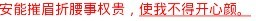

# Android TextView使用SpannableString设置样式

TextView通常用来显示普通文本，但是有时候需要对其中某些文本进行样式、事件方面的设置。

用来构建样式的具体的类都在`android.text.style`包下

flags，定义在Spannable中的常量，常用的有：

`Spanned.SPAN_EXCLUSIVE_EXCLUSIVE` -- (a,b) -- 不包含两端start和end所在的端点   
`Spanned.SPAN_EXCLUSIVE_INCLUSIVE` -- (a,b] -- 不包含端start，但包含end所在的端点   
`Spanned.SPAN_INCLUSIVE_EXCLUSIVE` -- [a,b) -- 包含两端start，但不包含end所在的端点   
`Spanned.SPAN_INCLUSIVE_INCLUSIVE` -- [a,b] -- 包含两端start和end所在的端点

Android系统通过SpannableString类来对指定文本进行相关处理，具体有以下功能：

|序号|Span|描述|
|---|----|---|
|1 |[BackgroundColorSpan](#BackgroundColorSpan)|背景色|
|2 |[ClickableSpan](#ClickableSpan)|文本可点击，有点击事件|
|3 |[ForegroundColorSpan](#ForegroundColorSpan)|文本颜色（前景色）|
|4 |[MaskFilterSpan](#MaskFilterSpan)|修饰效果，如模糊(BlurMaskFilter)、浮雕(EmbossMaskFilter)|
|5 |MetricAffectingSpan|父类，一般不用|
|6 |[RasterizerSpan](#RasterizerSpan)|光栅效果|
|7 |[StrikethroughSpan](#StrikethroughSpan)|删除线（中划线）|
|8 |[SuggestionSpan](#SuggestionSpan)|相当于占位符|
|9 |[UnderlineSpan](#UnderlineSpan)|下划线|
|10|[AbsoluteSizeSpan](#AbsoluteSizeSpan)|绝对大小（文本字体）|
|11|[DynamicDrawableSpan](#DynamicDrawableSpan)|设置图片，基于文本基线或底部对齐。|
|12|[ImageSpan](#ImageSpan)|图片|
|13|[RelativeSizeSpan](#RelativeSizeSpan)|相对大小（文本字体）|
|14|ReplacementSpan|父类，一般不用|
|15|[ScaleXSpan](#ScaleXSpan)| 基于x轴缩放|
|16|[StyleSpan](#StyleSpan)| 字体样式：粗体、斜体等|
|17|[SubscriptSpan](#SubscriptSpan)| 下标（数学公式会用到）|
|18|[SuperscriptSpan](#SuperscriptSpan)|上标（数学公式会用到）|
|19|[TextAppearanceSpan](#TextAppearanceSpan)|文本外貌（包括字体、大小、样式和颜色）|
|20|[TypefaceSpan](#TypefaceSpan)|文本字体|
|21|[URLSpan](#URLSpan)|文本超链接|
|22|[AlignmentSpan.Standard](#AlignmentSpan)|标准文本对齐样式|
|23|[BulletSpan](#BulletSpan)|着重样式|
|24|[DrawableMarginSpan](#DrawableMarginSpan)|图片+Margin样式|
|25|[IconMarginSpan](#IconMarginSpan)|图标+Margin样式|
|26|[LeadingMarginSpan](#LeadingMarginSpan)|文本缩进的样式|
|27|[QuoteSpan](#QuoteSpan)|引用样式|
|28|[TabStopSpan](#TabStopSpan)|制表位偏移样式|

Span效果图：   

##### 1、[BackgroundColorSpan 背景色](id:BackgroundColorSpan)

	SpannableString spanText = new SpannableString("萝卜白菜的博客 -- http://orgcent.com");
	spanText.setSpan(new BackgroundColorSpan(Color.GREEN), 0, spanText.length(), Spannable.SPAN_INCLUSIVE_EXCLUSIVE);
	mTVText.append("\n");
	mTVText.append(spanText);
	
`BackgroundColorSpan`，背景色样式，显然可以用来设定文本的背景色。该类有两个构造函数，   `BackgroundColorSpan(int color)`和`BackgroundColorSpan(Parcel src)`。   
`BackgroundColorSpan(int color)`：参数color，颜色值。    
`BackgroundColorSpan(Parcel src)`：参数src，包含颜色值信息的包装类，使用方法如下:   
	
	Parcel p = Parcel.obtain();
	p.writeInt(Color.GREEN);
	p.setDataPosition(0);
	BackgroundColorSpan bcs = new BackgroundColorSpan(p);
	
效果：   

##### 2、[ClickableSpan 文本可点击，有点击事件](id:ClickableSpan)

Android系统默认把网址、电话、地图(geo地址)、邮箱等转换为超链接。和HTML中的一样，默认超链接都带下划线的，下面的方案可以在TextView中去掉超链接的下划线：

1. 重写ClickableSpan类来去掉下划线样式（系统默认使用ClickableSpan来封装超链接）

		//无下划线超链接，使用textColorLink、textColorHighlight分别修改超链接前景色和按下时的颜色
		private class NoLineClickSpan extends ClickableSpan { 
		    String text;
			
		    public NoLineClickSpan(String text) {
		        super();
		        this.text = text;
		    }
			
		    @Override
		    public void updateDrawState(TextPaint ds) {
		        ds.setColor(ds.linkColor);
		        ds.setUnderlineText(false); //去掉下划线
		    }
			
		    @Override
		    public void onClick(View widget) { 
		        processHyperLinkClick(text); //点击超链接时调用
		    }
		}
		
2. 把超链接文本封装为NoLineClickSpan对象，并添加到TextView中

		TextView tv = findViewById(R.id.tv_click);
		SpannableString spStr = new SpannableString("萝卜白菜博客--&gt;http://orgcent.com");
		ClickSpan clickSpan = new NoLineClickSpan(vo); //设置超链接
		spStr.setSpan(clickSpan, 0, str.length(), Spanned.SPAN_INCLUSIVE_EXCLUSIVE);
		tv.append(spStr);
		// 设置超链接为可点击状态
		tv.setMovementMethod(LinkMovementMethod.getInstance());
		
	PS:在NoLineClickSpan类中实现onClick()回调方法；不用把TextView的属性autoLink设为”all”.
	
	
##### 3、[ForegroundColorSpan 文本颜色（前景色）](id:ForegroundColorSpan)

	spanText = new SpannableString("萝卜白菜的博客 -- http://orgcent.com");
	spanText.setSpan(new ForegroundColorSpan(Color.BLUE), 6, spanText.length(), Spannable.SPAN_INCLUSIVE_EXCLUSIVE);
	mTVText.append("\n");
	mTVText.append(spanText);
	
ForegroundColorSpan，字体颜色样式，用于改变字体颜色。该类有两个构造函数：   ForegroundColorSpan(int color)、ForegroundColorSpan(Parcel src)。   
ForegroundColorSpan(int color)：参数color，字体颜色。   
ForegroundColorSpan(Parcel src)：参数src，包含字体颜色信息的包装类，使用如下：   

	Parcel p = Parcel.obtain();
	p.writeInt(Color.YELLOW);
	p.setDataPosition(0);
	ForegroundColorSpan fcs = new ForegroundColorSpan(p);

效果：   

##### 4、[MaskFilterSpan 修饰效果，如模糊(BlurMaskFilter)、浮雕(EmbossMaskFilter)](id:MaskFilterSpan)

	spanText = new SpannableString("MaskFilterSpan -- http://orgcent.com");
	int length = spanText.length();
	//模糊(BlurMaskFilter)
	MaskFilterSpan maskFilterSpan = new MaskFilterSpan(new BlurMaskFilter(3, Blur.OUTER));
	spanText.setSpan(maskFilterSpan, 0, length - 10, Spannable.SPAN_INCLUSIVE_EXCLUSIVE);
	//浮雕(EmbossMaskFilter)
	maskFilterSpan = new MaskFilterSpan(new EmbossMaskFilter(new float[]{1,1,3}, 1.5f, 8, 3));
	spanText.setSpan(maskFilterSpan, length - 10, length, Spannable.SPAN_INCLUSIVE_EXCLUSIVE);
	mTVText.append("\n");
	mTVText.append(spanText);
	
PS:从最上面效果图看，浮雕效果不明显。把字体设置大点后可以看得清晰些。需要其他效果可以继承MaskFilter来自定义。

MaskFilterSpan，滤镜样式，只有一个构造函数：   
MaskFilterSpan(MaskFilter filter)：参数filter，滤镜样式。   

说明：
在android系统里，MaskFilter提供了两个子类，BlurMaskFilter和EmbossMaskFilter，分别用来制作模糊效果和浮雕效果。  

效果：   

##### 6、[RasterizerSpan 光栅效果](id:RasterizerSpan)

	spanText = new SpannableString("StrikethroughSpan");
	spanText.setSpan(new StrikethroughSpan(), 0, 7, Spannable.SPAN_INCLUSIVE_EXCLUSIVE);
	mTVText.append("\n");
	mTVText.append(spanText);
	
RasterizerSpan，字面义为光栅化，实际效果不明显，待完善。一个构造函数：
RasterizerSpan(Rasterizer r)：Rasterizer只有一个系统定义了的子类LayerRasterizer

##### 7、[StrikethroughSpan 删除线（中划线）](id:StrikethroughSpan)

	spanText = new SpannableString("StrikethroughSpan");
	spanText.setSpan(new StrikethroughSpan(), 0, 7, Spannable.SPAN_INCLUSIVE_EXCLUSIVE);
	mTVText.append("\n");
	mTVText.append(spanText);
	
StrikethroughSpan，删除线样式。该类有两个构造函数：   
StrikethroughSpan()和SrickkethroughSapn(Parcel src)。   
但有参数的构造函数并未对src参数做处理，
public StrikethroughSpan(Parcel src) {
}
因此这两个构造函数完全是同样的效果。   

##### 8、[SuggestionSpan](id:SuggestionSpan)

相当于占位符，一般用在EditText输入框中。当双击此文本时，会弹出提示框选择一些建议（推荐的）文字，选中的文本将替换此占位符。在输入法上用的较多。

PS：API 14新增

##### 9、[UnderlineSpan 下划线](id:UnderlineSpan)

	spanText = new SpannableString("UnderlineSpan");
	spanText.setSpan(new UnderlineSpan(), 0, spanText.length(), Spannable.SPAN_INCLUSIVE_EXCLUSIVE);
	mTVText.append("\n");
	mTVText.append(spanText);
	
UnderlineSpan，下划线样式，给一段文字加上下划线。构造函数：   
UnderlineSpan()： 无参构造。   
UnderlineSpan(Parcel src)：一参构造， 与无参构造效果相同，构造中未对src做处理。源码：
	
	public UnderlineSpan(Parcel src) {
	}
	
效果：   

##### 10、[AbsoluteSizeSpan 绝对大小（文本字体）](id:AbsoluteSizeSpan)

	spanText = new SpannableString("AbsoluteSizeSpan");
	spanText.setSpan(new AbsoluteSizeSpan(20, true), 0, spanText.length(), Spannable.SPAN_INCLUSIVE_EXCLUSIVE);
	mTVText.append("\n");
	mTVText.append(spanText);
	
顾名思义，AbsoluteSizeSpan是指绝对尺寸，通过指定绝对尺寸来改变文本的字体大小。该类有三个构造函数：   
AbsoluteSizeSpan(int size)、AbsoluteSizeSpan(int size, boolean dip)、   AbsoluteSizeSpan(Parcel src)。   

AbsoluteSizeSpan(int size)：参数size， 以size的指定的像素值来设定文本大小。   
AbsoluteSizeSpan(int size, boolean dip)：参数size，以size的指定像素值来设定文本大小，如果参数dip为true则以size指定的dip为值来设定文本大小。   
AbsoluteSizeSpan(Parcel src)：参数src，包含有size和dip值的包装类。在该构造中
	
	public AbsoluteSizeSpan(Parcel src) {
		mSize = src.readInt();
		mDip = src.readInt() != 0;    
	}
	
使用范例：

	Parcel p = Parcel.obtain();
	p.writeInt(29);//字体大小
	p.writeInt(8);//是否是dip单位
	p.setDataPosition(0);
	AbsoluteSizeSpan ass = new AbsoluteSizeSpan(p);

效果：   

##### 11、[DynamicDrawableSpan 设置图片，基于文本基线或底部对齐。](id:DynamicDrawableSpan)

左边图片基于基线对齐，右边图片基于底部对齐

	DynamicDrawableSpan drawableSpan = new DynamicDrawableSpan(DynamicDrawableSpan.ALIGN_BASELINE) {
	    @Override
	    public Drawable getDrawable() {
	        Drawable d = getResources().getDrawable(R.drawable.ic_launcher);
	        d.setBounds(0, 0, 50, 50);
	        return d;
	    }
	};
	DynamicDrawableSpan drawableSpan2 = new DynamicDrawableSpan(DynamicDrawableSpan.ALIGN_BOTTOM) {
	    @Override
	    public Drawable getDrawable() {
	          Drawable d = getResources().getDrawable(R.drawable.ic_launcher);
	          d.setBounds(0, 0, 50, 50);
	                return d;
	            }
	        };
	spanText.setSpan(drawableSpan, 3, 4, Spannable.SPAN_INCLUSIVE_EXCLUSIVE);
	spanText.setSpan(drawableSpan2, 7, 8, Spannable.SPAN_INCLUSIVE_EXCLUSIVE);
	mTVText.append("\n");
	mTVText.append(spanText);
	
##### 12、[ImageSpan 图片](id:ImageSpan)

和DynamicDrawableSpan差别不大

	spanText = new SpannableString("ImageSpan");
	Drawable d = getResources().getDrawable(R.drawable.ic_launcher);
	d.setBounds(0, 0, 50, 50);
	spanText.setSpan(new ImageSpan(d), 3, 4, Spannable.SPAN_INCLUSIVE_EXCLUSIVE);
	mTVText.append("\n");
	mTVText.append(spanText);
	
ImageSpan，图片样式，主要用于在文本中插入图片。本类构造函数较多，但主要是针对Bitmap和Drawable的，也可以通过资源Id直接加载图片。如下：   

ImageSpan(Bitmap b)：.参数b，用于显示的Bitmap。该方法已过时，改用Use ImageSpan(Context, Bitmap)代替。   

ImageSpan(Bitmap b, int verticalAlignment)：参数b，用于显示的Bitmap，参数verticalAlignment，对齐方式，对应ImageSpan中 的常量值。该方法已过时，改用ImageSpan(Context, Bitmap, int)代替。   

ImageSpan(Context context, Bitmap b)：参数context，传入的上下文，参数b，用于显示的Bitmap。    

ImageSpan(Context context, Bitmap b, int verticalAlignment)：参数context，传入的上下文，参数b，用于显示的Bitmap，参数verticalAlignment，对齐方式。

ImageSpan(Drawable d)：参数d，用于显示的Drawable，此Drawable须设置大小。

ImageSpan(Drawable d, int verticalAlignment)：参数d，用于显示的Drawable，参数verticalAlignment，对齐方式。

ImageSpan(Drawable d, String source)：参数d，用于显示的Drawable，参数source，资源字符串。

ImageSpan(Drawable d, String source, int verticalAlignment)：参数d，用于显示的Drawable，参数source，资源字符串，参数verticalAlignment，对齐方式。

ImageSpan(Context context, Uri uri)：参数context，传入的上下文，参数uri，图片的uri。

ImageSpan(Context context, Uri uri, int verticalAlignment)：参数context，传入的上下文，参数uri，图片的uri，参数verticalAlignment，对齐方式。

ImageSpan(Context context, int resourceId)：参数context，传入的上下文，参数resourceId，图片的资源id。

ImageSpan(Context context, int resourceId, int verticalAlignment)参数context，传入的上下文，参数resourceId，图片的资源id，参数verticalAlignment，对齐方式。   

效果：   

##### 13、[RelativeSizeSpan 相对大小（文本字体）](id:RelativeSizeSpan)

相对大小的比例是基于当前文本字体大小

	spanText = new SpannableString("RelativeSizeSpan");
	//参数proportion:比例大小
	spanText.setSpan(new RelativeSizeSpan(2.5f), 3, 4, Spannable.SPAN_INCLUSIVE_EXCLUSIVE);
	mTVText.append("\n");
	mTVText.append(spanText);
	
RelativeSizeSpan，相对大小，指相对于文本设定的大小的相对比例，如果没有设定则采用系统默认值。该类有两个构造函数：

RelativeSizeSpan(float proportion)：参数proportion，比例值。如果文字设定大小为A，则显示出来的大小为A×proportion。

RelativeSizeSpan(Parcel src)：参数src，包含了比例值信息的包装类。使用：

	Parcel p = Parcel.obtain();
	p.writeFloat(2.5f);
	p.setDataPosition(0);
	RelativeSizeSpan rss = new RelativeSizeSpan(p);

效果：   

##### 15、[ScaleXSpan 基于x轴缩放](id:ScaleXSpan)

	spanText = new SpannableString("ScaleXSpan -- 萝卜白菜的博客");
	//参数proportion:比例大小
	spanText.setSpan(new ScaleXSpan(3.8f), 3, 7, Spannable.SPAN_INCLUSIVE_EXCLUSIVE);
	mTVText.append("\n");
	mTVText.append(spanText);

ScaleXSpan，横向缩放样式，将字体按比例进行横向缩放。构造函数：

ScaleXSpan(float proportion)：参数proportion，缩放比例。如果字体设置的大小为A，则实际显示为A×proportion。

ScaleXSpan(Parcel src)：参数src，包含了缩放比例信息的包装类。使用：

	Parcel p = Parcel.obtain();
	p.writeFloat(2.5f);
	p.setDataPosition(0);
	ScaleXSpan rss = new ScaleXSpan(p);

效果：   

##### 16、[StyleSpan 字体样式：粗体、斜体等](id:StyleSpan)

	spanText = new SpannableString("StyleSpan -- 萝卜白菜的博客");
	//Typeface.BOLD_ITALIC:粗体+斜体
	spanText.setSpan(new StyleSpan(Typeface.BOLD_ITALIC), 3, 7, Spannable.SPAN_INCLUSIVE_EXCLUSIVE);
	mTVText.append("\n");
	mTVText.append(spanText);
	
StyleSpan，主要由正常、粗体、斜体和同时加粗倾斜四种样式，常量值定义在Typeface类中。构造函数：

StyleSpan(int style)：参数style，定义在Typeface中的常量。

StyleSpan(Parcel src)：参数src，包含字体信息的包装类，用法：

	Parcel p = Parcel.obtain();
	p.writeInt(Typeface.BOLD_ITALIC);
	p.setDataPosition(0);
	StyleSpan ss = new StyleSpan(p);

效果：   

##### 17、[SubscriptSpan 下标（数学公式会用到）](id:SubscriptSpan)

	spanText = new SpannableString("SubscriptSpan -- 萝卜白菜的博客");
	spanText.setSpan(new SubscriptSpan(), 6, 7, Spannable.SPAN_INCLUSIVE_EXCLUSIVE);
	mTVText.append("\n");
	mTVText.append(spanText);
	
SubscriptSpan,脚注样式，比如化学式的常见写法，当然，还可以对脚注的文字做一定的缩放。构造函数：

SubscriptSpan()：无参构造。

SubscriptSpan(Parcel src)：一参构造，参数src并未起任何作用，源码中为：

	public SuperscriptSpan(Parcel src) {
	}

效果：   

##### 18、[SuperscriptSpan 上标（数学公式会用到）](id:SuperscriptSpan)

	spanText = new SpannableString("SuperscriptSpan -- 萝卜白菜的博客");
	spanText.setSpan(new SuperscriptSpan(), 6, 7, Spannable.SPAN_INCLUSIVE_EXCLUSIVE);
	mTVText.append("\n");
	mTVText.append(spanText);
	
SuperscriptSpan，上标样式，比如数学上的次方运算，当然，还可以对上标文字进行缩放。构造函数：

SuperscriptSpan()：无参构造。

SuperscriptSpan(Parcel src)：一参构造，参数src并未起任何作用，源码中为：

	public SuperscriptSpan(Parcel src) {
	}

效果：   

##### 19、[TextAppearanceSpan 文本外貌（包括字体、大小、样式和颜色）](id:TextAppearanceSpan)

系统还提供了相关值TextAppearance_Small, TextAppearance_Large等。如有需要可在以上样式基础上修改。

	spanText = new SpannableString("TextAppearanceSpan -- 萝卜白菜的博客");
	//若需自定义TextAppearance，可以在系统样式上进行修改
	spanText.setSpan(new TextAppearanceSpan(this, android.R.style.TextAppearance_Medium), 6, 7, Spannable.SPAN_INCLUSIVE_EXCLUSIVE);
	mTVText.append("\n");
	mTVText.append(spanText);
	
TextAppearanceSpan，使用style文件来定义文本样式，该类有4个构造函数：

TextAppearanceSpan(Context context, int appearance)：参数context，传入的上下文，参数appearance，引用的样式表，如R.style.my_style。

TextAppearanceSpan(Context context, int appearance, int colorList)：参数context，使用的上下文，参数appearance，引用的样式表，如R.style.my_style，参数 colorList，使用方式未知，如果设置为小于0，则参数将不产生效果。

TextAppearanceSpan(String family, int style, int size,ColorStateList color, ColorStateList linkColor)：参数family，字体，仅支持系统自带的三种字体，MONOSPACE、SERIF和SANS，参数 style，TypeFace中定义的字体样式，BOLD、ITALIC等，参数size，字体大小，参数color，字体颜色，参数 linkColor，使用方式未知。

TextAppearanceSpan(Parcel src)：参数src，含有样式信息的包装类，样式信息参照5参构造。使用：

	Parcel p = Parcel.obtain();
	p.writeString(\"SERIF\");
	p.writeInt(Typeface.BOLD_ITALIC);
	p.writeInt(10);
	try {
	    ColorStateList colorlist = ColorStateList.createFromXml(ctx.getResources(),ctx.getResources().getXml(R.drawable.parcelcolorlist));
	    p.writeInt(1);
	    colorlist.writeToParcel(p, Parcelable.PARCELABLE_WRITE_RETURN_VALUE);
	    p.writeInt(1);
	    colorlist.writeToParcel(p, Parcelable.PARCELABLE_WRITE_RETURN_VALUE);
	} catch (Exception e) {
	    e.printStackTrace();
	}
	p.setDataPosition(0);
	TextAppearanceSpan tas = new TextAppearanceSpan(p);

注：在这个设置中style似乎并未起到作用，另外关于这个类的colorList和linkColor参数的使用尚不明了，有待解答。

效果：   

##### 20、[TypefaceSpan 文本字体](id:TypefaceSpan)

	spanText = new SpannableString("TypefaceSpan -- 萝卜白菜的博客");
	//若需使用自定义字体，可能要重写类TypefaceSpan
	spanText.setSpan(new TypefaceSpan("monospace"), 3, 10, Spannable.SPAN_INCLUSIVE_EXCLUSIVE);
	mTVText.append("\n");
	mTVText.append(spanText);
	
TypefaceSpan，字体样式，可以设置不同的字体，比如系统自带的SANS_SERIF、MONOSPACE和SERIF。构造函数：

TypefaceSpan(String family)：参数family，字体的值，以字符串表示。

TypefaceSpan(Parcel src)： 参数src，包含字体family信息的包装类，使用如下：

	Parcel p = Parcel.obtain();
	p.writeString(\"SERIF\");
	p.setDataPosition(0);
	TypefaceSpan ts = new TypefaceSpan(p);

效果：    

##### 21、[URLSpan 文本超链接](id:URLSpan)

	spanText = new SpannableString("URLSpan -- 萝卜白菜的博客");
	spanText.setSpan(new URLSpan("http://orgcent.com"), 10, spanText.length(), Spannable.SPAN_INCLUSIVE_EXCLUSIVE);
	mTVText.append("\n");
	mTVText.append(spanText);
	//让URLSpan可以点击
	mTVText.setMovementMethod(new LinkMovementMethod());
	
URLSpan，可以打开一个链接。两个构造函数：

URLSpan(String url)：参数url，链接地址。

URLSpan(Parcel src)：参数src，包含链接地址信息的包装类，使用如下：

	Parcel p = Parcel.obtain();
	p.writeString("http://www.sina.com.cn");
	p.setDataPosition(0);
	URLSpan us = new URLSpan(p);

效果：   

##### 22、[AlignmentSpan.Standard 标准文本对齐样式](id:AlignmentSpan)

AlignmentSpan.Standard， 标准文本对齐样式，该类有两个构造函数，

AlignmentSpan.Standard(Layout.Alignment align)和AlignmentSpan.Standard(Parcel src)。

AlignmentSpan.Standard(Layout.Alignment align)：参数align，Layout.Alignment类型的枚举值。包括居中、正常和相反三种情况。

AlignmentSpan.Standard(Parcel src)：参数src，包含有标准字符串的Parcel类，其值应为"ALIGN_CENTER"、"ALIGN_NORMAL" 或"ALIGN_OPPOSITE"中的之一，对应Layout.Alignment枚举中的三个类型。使用示例：
	
	Parcel p = Parcel.obtain();
	p.writeString(\"ALIGN_CENTER\");
	p.setDataPosition(0);
	AlignmentSpan.Standard standard = new AlignmentSpan.Standard(p);

效果：   

##### 23、[BulletSpan 着重样式](id:BulletSpan)

BulletSpan， 着重样式，类似于HTML中的\<li>标签的圆点效果。

该类有4个构造函数BulletSpan()、BulletSpan(int gapWidth)、BulletSpan(int gapWidth,int color)、BulletSpan(Parcel src)。

BulletSpan()：仅提供一个与文本颜色一致的符号。

BulletSpan(int gapWidth)： 提供一个与文本颜色一致的符号，并指定符号与后面文字之间的空白长度。

BulletSpan(int gapWidth,int color)：提供一个指定颜色的符号，并指定符号与后面文字之间的宽度。

BulletSpan(Parcel src)：参数src，包含宽度、颜色信息的包装类，在以此构造时，构造函数的调用如下：

	mGapWidth = src.readInt();
	mWantColor = src.readInt() != 0;
	mColor = src.readInt();

如果使用Parcel作为参数时，使用方式为：

	Parcel p = Parcel.obtain();
	p.writeInt(20);//设置gapWidth
	p.writeInt(1);//设置是否使用颜色
	p.writeInt(Color.YELLOW);//设置颜色
	p.setDataPosition(0);
	BulletSpan bs3 = new BulletSpan(p);

效果：   

##### 24、[DrawableMarginSpan 图片+Margin样式](id:DrawableMarginSpan)

DrawableMarginSpan，图片+Margin样式，该类有两个构造函数：DrawableMarginSpan(Drawable b)、DrawableMarginSpan(Drawable b,int pad)。

DrawableMarginSpan(Drawable b)：参数b，用于显示的图片。

DrawableMarginSpan(Drawable b,int pad)：参数b，用于显示的图片，参数pad，图片和文字的距离。

效果：   

##### 25、[IconMarginSpan 图标+Margin样式](id:IconMarginSpan)

IconMarginSpan，图标+Margin样式，该类与DrawableMarginSpan使用上很相似。本类有两个构造函数：

IconMarginSpan(Bitmap b)：参数b，用于显示图像的bitmap。

IconMarginSpan(Bitmap b,int pad)：参数b，用于显示图像的bitmap，参数pad，Bitmap和文本之间的间距。

效果：   

##### 26、[LeadingMarginSpan 文本缩进的样式](id:LeadingMarginSpan)

LeadingMarginSpan.Standard，文本缩进的样式。有3个构造函数，分别为：

Standard(int arg0)：参数arg0，缩进的像素。

Standard(int arg0, int arg1)：参数arg0，首行缩进的像素，arg1，剩余行缩进的像素。

Standard(Parcel p)： 参数p，包含缩进信息的包装类。在构造时，

	public Standard(Parcel src) {
	    mFirst = src.readInt();
	    mRest = src.readInt();
	}

使用方式：

	Parcel p = Parcel.obtain();
	p.writeInt(20);
	p.writeInt(30);
	p.setDataPosition(0);
	Standard lms = new Standard(p);

效果：   

##### 27、[QuoteSpan 引用样式](id:QuoteSpan)

QuoteSpan，引用样式，在文本左侧添加一条表示引用的竖线，该类有3个构造函数：

QuoteSpan()：无参构造，默认颜色为蓝色。

QuoteSpan(int color)：参数color，颜色值。

QuoteSpan(Parcel src)：包含颜色值信息的包装类。使用：

	Parcel p = Parcel.obtain();
	p.writeInt(Color.BLACK);
	p.setDataPosition(0);
	QuoteSpan qs = new QuoteSpan(p);

效果：   

##### 28、[TabStopSpan](id:TabStopSpan)制表位偏移样式

TabStopSpan.Standard，制表位偏移样式，距离每行的leading margin的偏移量，据测试在首行加入制表符时才产生效果。构造函数：

TabStopSpan.Standard(int where)：参数where，偏移量。

效果：   

---

［参考］

[[Android教程]TextView使用SpannableString设置复合文本](http://orgcent.com/android-textview-spannablestring-span)

[安卓文本样式-Spannable的使用](http://www.jcodecraeer.com/a/anzhuokaifa/androidkaifa/2015/0120/2335.html)