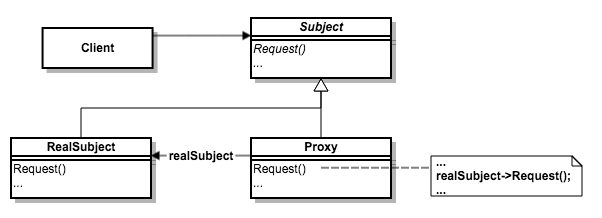

#设计模式空间
<table>
<tr>
	<th></th>
	<th></th>
	<th colspan="3">目的</th>
</tr>
<tr>
	<th></th>
	<th></th>
	<th align="center">Creational（创建型）</th>
	<th align="center">Structural（结构型）</th>
	<th align="center">Behavioral（行为型）</th>
</tr>
<tr>
	<th align="center">范围</th>
	<th align="center">类</th>
	<td align="center"><a href="#factory_method">Factory Method</a></td>
	<td align="center"><a href="#adapter">Adapter（类）</a></td>
	<td align="center">
		<a href="#interpreter">Interpreter</a> 
		<a href="#template_method">Template Method</a>
	</td>
</tr>
<tr>
	<th></th>
	<th align="center">对象</th>
	<td align="center">
		<a href="#abstract_factory">Abstract Factory</a> 
		<a href="#builder">Builder</a> 
		<a href="#prototype">Prototype</a> 
		<a href="#singleton">Singleton</a>
	</td>
	<td align="center">
		<a href="#adapter">Adapter（对象）</a> 
		<a href="#bridge">Bridge</a> 
		<a href="#composite">Composite</a> 
		<a href="#decorator">Decorator</a> 
		<a href="#facade">Facade</a> 
		<a href="#flyweight">Flyweight</a> 
		<a href="#proxy">Proxy</a> 
	</td>
	<td align="center">
		<a href="#chain_of_res">Chain of Responsibility</a> 
		<a href="#command">Command</a> 
		<a href="#iterator">Iterator</a> 
		<a href="#mediator">Mediator</a> 
		<a href="#memento">Memento</a> 
		<a href="#observer">Observer</a> 
		<a href="#state">State</a> 
		<a href="#strategy">Strategy</a> 
		<a href="#visitor">Visitor</a>
	</td>
</tr>
</table>

* **Abstract Factory**:提供一个创建一系列相关或相互依赖对象的接口，而无需指定它们具体的类。

* **Adapter**:将一个类的接口转换成客户希望的另外一个接口。Adapter模式使得原本由于接口不兼容而不能一起工作的那些类可以一起工作。
* **Bridge**:将抽象部分与它的实现部分分离，使它们都可以独立地变化。

* **Builder**:将一个复杂对象的构建与它的表示分离，使得同样的构建过程可以创建不同的表示。

* **Chain of Responsibility**:为解除请求的发送者和接受者之间耦合，而使多个对象都有机会处理这个请求。将这些对象连成一条链，并沿着这条链传递该请求，直到有一个对象处理它。
* **Command**:将一个请求封装为一个对象，从而使你可用不同的请求对客户进行参数化；对请求排队或记录请求日志，以及支持可取消的操作。
* **Composite**:将对象组合成树形结构以表示“部分－整体”的层次结构。Composite使的客户对单个对象和复合对象的使用具有一致性。

* **Decorator**:动态地给一个对象添加一些额外的职责。就扩展功能而言，Decorator模式比生成子类方式更为灵活。

* **Facade**:为子系统中的一组接口提供一个一致的界面，Facade模式定义了一个高层接口，这个接口使得这一子系统更加容易使用。

* **Factory Method**:定义一个用于创建对象的接口，让子类决定将哪一个类实例化。Factory Method使一个类的实例化延迟到其子类。

* **Flyweight**: 运用共享技术有效地支持大量细粒度的对象。

* **Interpreter**: 给定一个语言，定义它的文法的一种表示，并定义一个解释器，该解释器使用该表示来解释语言中的句子。
* **Iterator**: 提供一种方法顺序访问一个聚合对象中各个元素，而又不需要暴露该对象的内部表示。
* **Mediator**: 用一个中介对象来封装一系列的对象交互。中介者使各对象不需要显示地相互引用，从而使其耦合松散，而且可以独立地改变它们之间的交互。
* **Memento**: 在不破坏封装性的前提下，捕获一个对象的内部状态，并在该对象之外保存这个状态。这样以后就可将该对象恢复到保存的状态。
* **Observer**: 定义对象间的一种一对多的依赖关系，以便当一个对象的状态发生改变时，所有依赖于它的对象都得到通知并自动刷新。
* **Prototype**: 用原型实例指定创建对象的种类，并且通过拷贝这个原型来创建新的对象。

* **Proxy**: 为其他对象提供一个代理以控制对这个对象的访问。

* **Singleton**: 保证一个类仅有一个实例，并提供一个访问它的全局访问点。

* **State**: 允许一个对象在其内部状态改变时改变它的行为。对象看起来似乎修改了它所属的类。
* **Strategy**: 定义一系列的算法，把它们一个个封装起来，并且使它们可相互替换。本模式使得算法的变化可独立于使用它的客户。
* **Template Method**: 定义一个操作中的算法的骨架，而将一些步骤延迟到子类中。Template Method使得子类可以不改变一个算法的结构即可重定义该算法的某些特定步骤。
* **Visitor**: 表示一个作用于某对象结构中的各元素的操作。它使你可以在不改变各元素的类的前提下定义作用于这些元素的新操作。

# 设计模式之间的关系

# 设计模式所支持的设计的可变方面

<table>
<tr>
<th align="center">目的</td>
<th align="center">设计模式</td>
<th align="center">可变的方面</td>
</tr>

<tr>
<td align="center">创建</td>
<td>
Abstract Factory 
Builder 
Factory Method 
Prototype 
Singleton
</td>
<td>
产品对象家族 
如何创建一个组合对象 
被实例化的子类 
被实例化的类 
一个类的唯一实例
</td>
</tr>

<tr>
<td align="center">结构</td>
<td>
Adapter 
Bridge 
Composite 
Decorator 
Facade 
Flyweight 
Proxy
</td>
<td>
对象的接口 
对象的实现 
一个对象的结构和组成 
对象的职责，不生成子类 
一个子系统的接口 
对象的存储开销 
如何访问一个对象；该对象的位置
</td>
</tr>

<tr>
<td align="center">行为</td>
<td>
Chain of Responsibility 
Command 
Interpreter 
Iterator 
Mediator 
Memento 
Observer 
State 
Strategy 
Template Method 
Visitor
</td>
<td>
满足一个请求的对象 
何时、怎样满足一个请求 
一个语言的文法及解释 
如何遍历、访问一个聚合的各元素 
对象间怎样交互、和谁交互 
一个对象中哪些私有信息存放在该对象之外，以及在什么时候存储 
多个对象依赖于另外一个对象，而这些对象又如何保持一致 
对象的状态 
算法 
算法中的某些步骤 
某些可作用于一个（组）对象上的操作，但不修改这些对象的类
</td>
</tr>
</table>